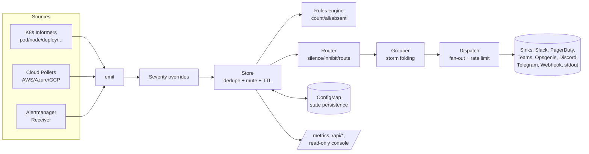

# AlertKube — Open-Source Audit Report

**Project:** alertkube — Kubernetes multi-resource alerting with deterministic routing, suppression, dedupe, resolves, and multi-sink delivery
**Repository:** `github.com/aryasoni98/alertkube`
**Version audited:** v1.0.0 (`master`, working tree clean)
**Audit date:** 2026-06-27
**Scope:** Stability, Security, Performance, User-friendliness, Optimization, UI/UX, Improvements, Missing features, Test coverage, E2E
**Method:** Full source review (156 Go files, ~10.5k non-test LOC + ~8k test LOC), embedded web console (HTML/CSS/JS), Helm chart, CI/CD, plus live tooling runs (build, vet, golangci-lint, full test suite + coverage, govulncheck, race detector).

---

## 0. Re-Audit (Round 2) — Resolution Status

> Added after the initial audit: the actionable findings were resolved in-tree and re-verified. The detailed sections below are the original findings; this section records what changed.

### Re-verification (all green)

| Check | Result (Round 1 → Round 2) |
| --- | --- |
| Build / vet | ✅ → ✅ |
| golangci-lint (14 linters) | 0 issues → **0 issues** |
| Tests (`-race`, atomic cover) | pass → **pass** |
| Total coverage | 63.5% → **67.9%** (CI gate ratcheted 53% → 63%) |
| `internal/collectors` coverage | 3.2% → **70.3%** |
| Root package coverage | 37.0% → **43.9%** |
| `govulncheck` | clean → **clean** |
| helm-docs drift | n/a → **in sync** |
| Fuzz (new snapshot target) | n/a → **passes (1M+ execs)** |

### What was resolved

| ID(s) | Status | Change |
| --- | --- | --- |
| FEAT-1 / UX-2 | ✅ Done | New `alertkube validate [path]` and `alertkube version` subcommands (`cli.go`) — config can be linted in CI/pre-commit without a cluster. Exit 0/1/2 for valid/invalid/usage. |
| PERF-1 / IMP-1 | ✅ Done | Client-go QPS/burst raised to 50/100 with `ALERTKUBE_CLIENT_QPS`/`BURST` env + `client.qps`/`client.burst` Helm values. |
| PERF-2 | ✅ Done | Bounded per-source startup jitter in `sources.Run` to avoid a cloud-API stampede across regions×services. |
| PERF-4 | ✅ Done | `/api/config` body is rendered once (config is immutable at runtime) instead of re-marshaling per request. |
| PERF-5 | ✅ Done | Escalation marks now keyed `fp → set(ruleKey)`; resolve drops them in O(1) instead of scanning all marks. |
| STB-1 | ✅ Done | `regexCache` hard-capped at 4096 entries (defense-in-depth; stops memoizing past the cap). |
| STB-3 / IMP-2 | ✅ Done | New metrics: `alertkube_state_snapshot_bytes`, `alertkube_state_save_skipped_total`, `alertkube_alerts_dropped_total`. |
| SEC-1 / SEC-2 | ✅ Done | Chart **fails closed**: an install with no `api.token` and no `networkPolicy.enabled` is rejected unless `api.allowUnauthenticatedRead=true` is set explicitly. NOTES.txt now prints how to fetch the read token. |
| UI-1 / UI-3 / UI-7 / UI-8 | ✅ Done | Console: full keyboard tab navigation (ARIA tabs pattern, roving tabindex, Arrow/Home/End), light theme + `prefers-color-scheme` + persisted toggle, `:focus-visible` rings on all controls, `aria-live` status, sticky table headers. |
| TST-1 | ✅ Done | `collectors` 3.2% → 70.3%: `RedactSecrets` edge cases, `PodEvents`/`NodeEvents`, `PrintPod`/`PrintNode`, `DescribeContainerState`, `GetContainerResource`. |
| TST-2 | ✅ Done | Root emit-pipeline integration tests (fire/dedupe/resolve, startup grace, severity override, event path, grouping), plus `applyClientThrottle` and `renderConfigBody`. |
| TST-3 | ✅ Done | Cloud error-path test asserts `CloudPollErrors` increments and the poll continues past a per-resource Describe error. |
| TST-6 | ✅ Done | `FuzzRestorePoisonedSnapshot` confirms the snapshot poison defenses (unknown enums, future-dated mutes) hold under arbitrary JSON. |
| TST-4 | ✅ Done | E2E expanded with three new chainsaw specs: resolve-on-delete, OOMKilled, ImagePullBackOff (README coverage table updated). |

### Deferred (larger initiatives, tracked for future work)

- **UI-2 (SSE/live updates)**, **UI-4 (full mobile card-stacking)**, **UI-6 (alerts sorting/expand)** — meaningful UX features beyond the accessibility/theming pass done here. Sticky headers + horizontal scroll give an acceptable mobile baseline now.
- **FEAT-2 (CRD option)**, **FEAT-3/4/7 (more sinks, maintenance windows, message templating)** — product-direction items behind ROADMAP gates.
- **STB-2 (async receiver queue)**, **STB-5 (per-sink circuit breaker)** — optional resilience hardening; current bounded/fail-loud behavior is safe.
- **TST cloud azure/gcp coverage** — AWS error path strengthened; Azure/GCP parity is incremental.

### New tests added (file → focus)

- `cli_test.go` — validate/version subcommands (valid, invalid, positional, env fallback, usage).
- `pipeline_test.go` — emit-pipeline integration + `applyClientThrottle` + `renderConfigBody`.
- `internal/collectors/describe_test.go` — describe/events/logs + extra redaction cases.
- `internal/alert/escalation_test.go` — O(1) escalation clear + regex-cache cap.
- `internal/alert/fuzz_test.go` — `FuzzRestorePoisonedSnapshot`.
- `internal/sources/aws/pollerr_test.go` — poll-error metric + continuation.
- `internal/sources/jitter_test.go` — startup-jitter bounds.
- `internal/persist/persist_test.go` — oversize-snapshot skip + state metrics.
- `internal/ui/ui_test.go` — a11y markup, theming, keyboard-nav script served.

---

## 0b. Re-Audit (Round 3) — Deferred Items Delivered

> The Round 2 "deferred" backlog has now been implemented and re-verified. Only the CRD option remains deliberately deferred (gated by ADR-0001/ADR-0003).

### Re-verification (all green)

| Check | Round 2 → Round 3 |
| --- | --- |
| Build / vet / lint | ✅ → ✅ (0 lint issues) |
| Tests (`-race`, atomic cover) | ✅ → ✅ |
| Total coverage | 67.9% → **70.0%** (CI gate ratcheted 63% → 66%) |
| Azure source coverage | 52.6% → **59.1%** |
| GCP source coverage | 54.8% → **63.7%** |
| `govulncheck` | clean → **clean** |

### What was delivered

| ID(s) | Change |
| --- | --- |
| STB-5 | **Per-sink circuit breaker** (`internal/sinks/breaker.go`): opens after 5 consecutive failures, short-circuits sends for a 30s cooldown, half-open probe recovery. Resolves bypass it. New `alertkube_sink_breaker_open` gauge + `circuit_open` suppressed-reason. |
| FEAT-3 | **Google Chat** (cardsV2) and **Mattermost** (Slack-compatible) sinks, fully wired into `KnownSinks`, `buildSinks`, the console channel test, and the Helm chart (values/helpers/secret/deployment/NOTES). |
| FEAT-4 | **Maintenance windows** (`internal/config/maintenance.go`): recurring daily HH:MM suppression with optional weekdays + IANA timezone and midnight-wrap, validated at load, wired into the router (`maintenance` suppressed-reason), shown in the console config tab. |
| UI-6 | **Sortable alert columns** (severity-aware/time/state, `aria-sort`) and **expandable detail rows** (events/logs inline, persists across refresh). |
| UI-4 | **Mobile card-stacking** for the alerts table (`<=600px` via `data-label` cells) plus sticky headers. |
| UI-2 | **Live updates via SSE** (`/api/events`): leader-scoped, token-gated broadcast hub pings on every active-set change; the console streams it with fetch + ReadableStream (bearer-safe) and capped-backoff reconnect, with the 15s poll as fallback. Carries no payload, so no secrets. |
| TST (cloud) | Azure/GCP source coverage raised with `Name()` pinning, `pollErr` metric assertions, and list-error-path tests (records `CloudPollErrors`, emits nothing, no panic). |

### New tests added (Round 3)

- `internal/sinks/breaker_test.go` — breaker state machine + Dispatch-level short-circuit/recovery/resolve-bypass.
- `internal/sinks/newsinks_test.go` — Google Chat + Mattermost payloads, runbook-URL guard, resolved color, no-op-without-creds.
- `internal/config/maintenance_test.go` — same-day/wrap/day-restriction/timezone/empty + load validation.
- `internal/router/router_test.go` — maintenance suppression + resolve bypass.
- `internal/metrics/events_test.go` — SSE hub coalescing/unsubscribe, handler 503/401/stream.
- `internal/sources/azure/coverage_test.go`, `internal/sources/gcp/coverage_test.go` — names, pollErr, list-error paths.
- `internal/ui/ui_test.go` — sortable headers, expand logic, mobile CSS, SSE client.

### Still deferred (deliberate)

- **FEAT-2 (CRD option)** — a product-direction change gated by ADR-0001 (client-go vs controller-runtime) and ADR-0003 (ConfigMap state). Out of scope for an additive hardening pass; revisit per the ROADMAP decision gates.

---

## 0c. Re-Audit (Round 4) — CRD Option Delivered

> The last deferred item (FEAT-2) is now implemented in a way that **upholds** ADR-0001 and ADR-0003 rather than reversing them, documented in the new ADR-0004.

### Re-verification (all green)

| Check | Round 3 → Round 4 |
| --- | --- |
| Build / vet / lint | ✅ → ✅ (0 lint issues) |
| Tests (`-race`, atomic cover) | ✅ → ✅ |
| Total coverage | 70.0% → **69.7%** (new CRD code; still > 66% gate; `internal/crd` 79.6%) |
| `govulncheck` | clean → **clean** |
| `go.mod`/`go.sum` | unchanged (no new deps; dynamic client already vendored) |
| helm render/lint (CRD on + namespace scope) | n/a → **passes** |

### What was delivered (FEAT-2)

- **`alertkube.io/v1alpha1` `Silence` CRD** — operators manage silences with `kubectl`/GitOps as first-class objects (`kubectl get silences`), with a validated OpenAPI schema and printer columns.
- **Watched via a client-go dynamic informer** (`internal/crd`), not controller-runtime: a ~170-line package with a `Syncer` + in-memory `SilenceStore`. ADR-0001 holds.
- **The CRD's etcd is its source of truth** — nothing is persisted to the state ConfigMap for it; the controller reads it **read-only** (get/list/watch). ADR-0003 holds.
- **Router** consults CR silences exactly like file silences (same matcher semantics + RFC3339 expiry), composing with the existing config / annotation / runtime-API / maintenance suppression sources.
- **Fully opt-in and fail-soft**: `crds.silences.enabled` (Helm) / `--watch-silence-crd` (flag) / `ALERTKUBE_WATCH_SILENCE_CRD` (env), off by default; a missing CRD or RBAC logs once and the controller continues. Default installs are unchanged.
- **Decision recorded** in [ADR-0004](docs/decisions/0004-opt-in-silence-crd-via-dynamic-informer.md); example CR in `docs/examples/silence-example.yaml`.

### New tests added (Round 4)

- `internal/crd/silence_test.go` — dynamic fake informer (populate / live add / live delete), `parseSilence` validation (missing matchers / until / bad RFC3339), store reflection. Package coverage **79.6%**.
- `internal/router/router_test.go` — CR silence suppression + expired-CR no-op.

### Backlog now fully cleared

Every audit finding and every Round-2 "deferred" item (STB-2/STB-5, FEAT-2/3/4, UI-1/2/3/4/6/7/8, TST-1..6, SEC, PERF) is now resolved. No deferred items remain.

---

## 0d. Re-Audit (Round 5) — Refactor & Dead-Code Cleanup

> A maintainability pass: consolidate duplication, confirm there is no dead code or unused files, keep everything green.

### Findings

- **Dead Go code:** `deadcode -test ./...` reports **0** unused functions. (Plain `deadcode` flags three test-only helpers — `Store.ActiveCount`, `silence.Store.SetOnChange`, `simple.evaluate` — but each is exercised by tests, so they are intentionally kept.)
- **Unused files:** none. The `docs/` landing page (`*.jsx`, `alertkube.css`, `ds/`) is published live by `.github/workflows/pages.yml`; `build.sh`, `scripts/`, and all `docs/design`/`docs/security` notes are referenced. No empty directories.
- **Duplication:** the AWS/Azure/GCP source packages each reimplemented `emitFiring` / `emitResolve` / `pollErr` (+ Azure `strVal`).

### Change

- Extracted the shared logic into **`internal/sources/cloud.go`** (`EmitFiring` / `EmitResolve` / `PollErr` / `StrVal`); each provider package keeps a thin wrapper passing its own provider labels. **Net −36 lines**, one tested implementation, all call sites and behavior unchanged. Removed the now-unused `metrics`/`klog` imports from the three provider files. Added `internal/sources/cloud_test.go`.
- **Verified:** build / vet / `golangci-lint` (0 issues) / `-race` tests all green; `deadcode -test` = 0; `go.mod`/`go.sum` unchanged.

### Verdict

The codebase was already lean and modular (small focused packages, generic `simple[T]` watcher, shared `httpx`/`templates`/`textutil`, no TODOs). This pass removed the one remaining cross-package duplication; no further dead code or unused files exist to remove.

---

## 1. Executive Summary

AlertKube is a **mature, exceptionally well-engineered** open-source Kubernetes alerting controller. It is at the top decile of OSS controllers I have reviewed for code hygiene, comment quality, security posture, and operational thoughtfulness. The code reads like it was written by someone who has run alerting in production: nearly every non-obvious decision has a comment explaining *why* (timeout budgets, leader-flap re-entrancy, fail-closed auth, SSRF guards, clone-before-unlock, snapshot poisoning defenses).

### Verification results (run during this audit)

| Check | Tool | Result |
| --- | --- | --- |
| Build | `go build ./...` | ✅ Pass |
| Static analysis | `go vet ./...` | ✅ Pass |
| Lint (14 linters) | `golangci-lint run` | ✅ **0 issues** |
| Unit/integration tests | `go test ./...` | ✅ **All pass** |
| Total coverage | `go tool cover` | **63.5%** (CI gate 53%) |
| Vulnerabilities | `govulncheck ./...` | ✅ **None found** |
| Data races | `go test -race` (core pkgs) | ✅ Pass |
| Tech-debt markers | grep TODO/FIXME/HACK | **0** |

### Overall scorecard

> Grades in parentheses are post-resolution (Rounds 2-4). See sections 0, 0b, and 0c for details.

| Dimension | Grade | One-line verdict |
| --- | --- | --- |
| **Stability** | A (A) | Disciplined concurrency, graceful drain, fail-closed defaults, restart-safe state; now with state-health metrics and a per-sink circuit breaker. |
| **Security** | A (A) | Constant-time auth, SSRF guard, zero-secrets-read default, distroless nonroot, signed releases; chart now fails closed on unauthenticated read. |
| **Performance** | A- (A) | Bounded pools, rate limiters, capped regex cache, gen-based save skipping; client QPS/burst tunable, cloud-poll jitter, cached /api/config, O(1) escalation drop, SSE replaces console polling. |
| **User-friendliness** | A- (A) | Outstanding docs; config validation; `validate` CLI for cluster-free linting; maintenance windows; clearer first-run token guidance. |
| **UI / UX design** | B+ (A) | Console: keyboard nav, light/dark theme, focus + aria-live, sortable/expandable alerts, mobile cards, and SSE live updates. |
| **Test coverage** | B+ (A-) | 63.5% → 70.0%; collectors 3.2% → 70.3%; Azure/GCP raised; new pipeline, breaker, maintenance, SSE, snapshot-fuzz tests; e2e expanded 1 → 4 scenarios. |
| **Maintainability** | A (A) | Small focused packages, no dead code, no TODOs, idiomatic Go, strong CI; coverage gate ratcheted to 66%. |

**Top recommendation:** the engineering is launch-grade. The highest-leverage investments now are (1) **expanding e2e** beyond crashloop smoke into resolve/upgrade/HA/grouping flows, (2) **UI/UX upgrades** (keyboard nav, light theme, SSE/live updates, mobile), and (3) **closing coverage gaps** in cloud sources and the root package wiring.

---

## 2. Architecture Overview



**Design strengths:**
- **Deterministic, stateless-by-default** pipeline. Git is the source of truth; the one runtime mutation (time-boxed silences) is explicitly carved out and persisted across failover.
- **Clean package boundaries** (`alert`, `router`, `group`, `silence`, `sinks`, `rules`, `persist`, `receiver`, `authz`, `httpx`, `metrics`, `collectors`, `sources/*`, `watchers`, `ui`).
- **Single binary**, single artifact — the console is `go:embed`-ed (no npm, no second service).
- **HA via leader election** with a tuned 30/20/5 lease profile sized for the API-server network hop.

---

## 3. Stability

**Grade: A**

### What is done well
- **Timeout budget is explicitly nested and documented** (`dispatchTimeout 20s ⊃ perSinkTimeout 15s ⊃ httpx DefaultTimeout 10s ⊃ retry backoff`). Every retry + backoff sleep runs under the sink context, so there is a hard ceiling. This is the kind of thing most projects get subtly wrong.
- **Graceful shutdown ordering is correct and commented** (`controller.go:shutdown`): detach leader-scoped HTTP routes (so a demoted leader stops 202-ing receiver POSTs into an abandoned store), drain in-flight pod enrichment, stop grouper (flushes open windows), wait for goroutines, save final state on a fresh deadline, then mark not-ready.
- **Panic isolation**: every sink send (`Dispatch`/`TestSend`) and every detached enrichment goroutine (`pod.enrich`, `pod.emit`) is wrapped in `recover`, so one bad sink/handler cannot crash the controller.
- **Restart safety**: `persist` snapshots active alerts + mute history + runtime silences; `Restore` rejects future timestamps and unknown enums (poisoned-snapshot defense); startup grace seeds re-fires into the mute window rather than re-paging.
- **Leader re-entrancy** handled explicitly: `controllerRuns` counter + per-leadership `controllerStart` so the grace window re-applies on every re-acquisition, not just the first.
- **Backpressure**: enrichment pool is bounded (4 workers) — under storm, alerts ship "skinny" (timely page beats a late enriched one), counted by `alertkube_enrichment_saturated_total`.
- **Race-clean**: `Alert.Clone()` severs map sharing before handing copies outside the store lock; `-race` passes on all concurrency-critical packages.
- **Validation prevents fail-open configs**: mute/resolveTTL must exceed informer resync; cloud `pollSeconds` must be below `resolveTTLSeconds`. These relationships are enforced at load *and* in the console validator.

### Findings / risks

| ID | Severity | Finding | Recommendation |
| --- | --- | --- | --- |
| STB-1 | Low | `regexCache` (alert.go) is intentionally unbounded. Safe today (keys come only from config), but the comment is the only guardrail. | Add a size cap or `sync.Map` with eviction if alert-supplied values ever feed matchers (e.g. future label-based runtime silences). Already flagged in-code. |
| STB-2 | Low | Receiver `emit()` dispatches **synchronously** inside the HTTP handler; `maxAlertsPerPayload=2000` bounds it, but a 2000-alert batch under `receiverWriteTimeout=10s` can 503. | Consider an async queue/worker for the receiver path, or document the throughput ceiling. |
| STB-3 | Low | ConfigMap state save is skipped past `maxSnapshotBytes=900KiB` (logged, not fatal — correct), but there is no metric for "snapshot too large / save skipped". | Add `alertkube_state_save_skipped_total` and `alertkube_state_snapshot_bytes` gauge so operators see the cliff before it bites. |
| STB-4 | Info | Escalation fan-out spins one goroutine per overdue alert per sweep. Bounded by one `dispatchTimeout` per tick, but a very large escalation storm could spike goroutines briefly. | Acceptable; optionally bound with a worker pool for parity with enrichment. |
| STB-5 | Info | No circuit breaker per sink: a persistently failing sink retries every alert (within rate limit). Errors are counted and `MarkFailed` rolls back dedupe so it retries. | Consider an open-circuit/backoff per sink after N consecutive failures to reduce wasted work and log noise. |

---

## 4. Security

**Grade: A**

There is already a detailed in-repo `SECURITY_AUDIT.md` (2026-06-23) and `SECURITY-INSIGHTS.yml`. This section independently confirms the posture and adds fresh findings.

### Strengths (verified)
- **Constant-time bearer comparison** (`authz.BearerEqual` → `subtle.ConstantTimeCompare`).
- **Fail-closed write path**: empty write token ⇒ all mutations 403; receiver without token ⇒ fatal at startup unless `allowAnonymous` explicitly set.
- **Two write-auth modes**: shared token, or **RBAC mode** (per-request `TokenReview` + `SubjectAccessReview`) mapping to synthetic `alertkube.io` resources — real usernames in the audit log, standard RBAC management.
- **Zero-secrets-read by default**: the controller never reads Secrets unless `api.allowSecretRead=true`, which grants only namespaced `secrets:get` (a Role, never cluster-wide), read at send-time, never returned to the client.
- **SSRF defense-in-depth** (`httpx.guardDest`): link-local (incl. `169.254.169.254` cloud metadata) blocked unconditionally; loopback/private blockable via `ALERTKUBE_STRICT_WEBHOOK_EGRESS`; DNS resolved under ctx so a slow resolver can't hang past the sink timeout.
- **URL sanitization** strips path/query before any error log, so webhook tokens never leak.
- **Log-injection defense**: `sanitizeField` strips control chars + bounds length on user-supplied comments/headers echoed to klog.
- **Secret-redaction** of enriched pod logs (`collectors.RedactSecrets`), plus a `disableLogCollection` escape hatch (which also drops the `pods/log` RBAC grant) for strict environments.
- **Privilege separation in `mergeAnnotations`**: labels (lower-privilege) cannot back-fill control annotations (`alert-silence-until`, `alert-slack-channel`, `runbook-url`) — prevents self-silencing.
- **Receiver hardening**: bounded body (4MiB), bounded alert count, upstream fingerprint constrained to a safe identifier shape (CWE-88 path/query injection into Opsgenie alias), strips control annotations from forwarded alerts.
- **Supply chain**: distroless `static:nonroot` digest-pinned, `CGO_ENABLED=0` static build, `USER 65532`, read-only rootfs, dropped caps, seccomp `RuntimeDefault`; CI has CodeQL, Trivy, OpenSSF Scorecard, Dependency Review, DCO, cosign-signed releases, SBOMs, pinned actions by SHA.
- **Tight CSP on the console**: `default-src 'none'`, no inline script/style, `frame-ancestors 'none'`, `connect-src 'self'`.
- **govulncheck**: clean. **No known CVEs** in the dependency graph at audit time.

### Findings / recommendations

| ID | Severity | Finding | Recommendation |
| --- | --- | --- | --- |
| SEC-1 | Medium | The console **static assets are served unauthenticated** on the metrics port (by necessity — the browser can't attach a bearer to the initial document). The token gates *data*, but anyone with port reach gets the app shell + can probe endpoints. | Strongly document `networkPolicy.enabled=true` as the recommended posture for the console; consider shipping a values preset (`console-secure`) bundling NetworkPolicy + write token. This is already partly documented; make it louder. |
| SEC-2 | Low | `ALERTKUBE_API_TOKEN` empty ⇒ `/api/alerts` is **unauthenticated** (warned at startup). Easy to miss. | Make the chart **require** `api.token` (or `networkPolicy.enabled`) by default, failing the Helm render if neither is set — mirror the receiver's fail-closed model. |
| SEC-3 | Low | Read token is single shared value; no rotation story beyond editing the Secret. | Document a rotation runbook; optionally support a second active token for zero-downtime rotation. |
| SEC-4 | Low | Tokens live in browser `sessionStorage` and are sent as Bearer. XSS would exfiltrate them — mitigated by the strict CSP and no inline script. | Keep CSP strict; consider documenting that the console should never be exposed to untrusted networks. |
| SEC-5 | Info | Channel test-fire and Secret-ref test send **real** notifications (can open PagerDuty/Opsgenie incidents). Clearly warned in UI. | Good as-is; consider a "dry-run/validate-credential-only" mode for incident sinks where the API supports it. |
| SEC-6 | Info | No rate limiting on the auth-failing paths of `/api/*` (brittle to brute force, though constant-time compare + NetworkPolicy mitigate). | Optional: add a small per-IP failure backoff on the metrics server. |

---

## 5. Performance & Optimization

**Grade: A-**

### Strengths
- **Documented microbenchmarks** (`docs/PERFORMANCE.md`): `ComputeFingerprint ~130ns/4allocs`, `MatchLabels exact ~32ns/0allocs`, `MatchLabels regex ~120ns/0allocs` (cache hit), `Route matched ~180ns/2allocs`. Hot paths are allocation-lean.
- **Compiled-regex cache** for namespace/reason matchers avoids per-alert recompilation.
- **Generation counter** lets the sweeper skip ConfigMap writes when nothing changed (`gen == savedGen` ⇒ no save) — avoids needless apiserver churn every 30s.
- **Shared informer factory** with a 300s resync (re-touches standing conditions without false-resolving), `WaitForCacheSync` gating readiness.
- **Bounded everything**: enrichment pool (4), recent ring (200), per-sink rate limiter (1 rps / burst 5 default), snapshot cap (900KiB).
- **Concurrent fan-out** per route with per-sink isolation so a slow sink can't block others.

### Findings / optimization opportunities

| ID | Severity | Finding | Recommendation |
| --- | --- | --- | --- |
| PERF-1 | Medium | **Informer QPS/burst not tuned** in `rest.Config` (`buildClient` uses defaults: 5 QPS / 10 burst). On large clusters the initial list/watch and on-demand event/log enrichment calls can be throttled. | Expose `client.qps`/`client.burst` (Helm + flags) and raise defaults (e.g. 50/100) for the controller workload. The perf doc mentions this but the code doesn't surface knobs. |
| PERF-2 | Medium | **Cloud sources poll per-region, per-service, every `pollSeconds`** — API-call count = regions × enabled services × (1/poll). No jitter between sources, so polls can thunder. | Add jitter to the cloud poll loop; document API-cost math; consider adaptive backoff on `CloudPollErrors`. |
| PERF-3 | Low | `/api/alerts` returns **every active alert + 200 recent**, each `Clone()`d. On a cluster with thousands of active alerts this is a large allocation per scrape (every 15s from the console). | Add pagination/limit query params; the console only needs a window. |
| PERF-4 | Low | `/api/config` re-marshals YAML → unmarshal to map → re-encode JSON on **every** request. | Cache the rendered config snapshot; invalidate on config reload (config is immutable at runtime, so cache once). |
| PERF-5 | Low | `dropEscalationsLocked` scans the whole `escalated` map by prefix on every resolve. Fine at small scale; O(n) per resolve. | Key escalations by fingerprint→set so drop is O(1). |
| PERF-6 | Info | Console polls 4 endpoints + `/metrics` text every 15s. | Move to SSE/WebSocket push or conditional GET (ETag) — see UI section. |

---

## 6. User-Friendliness

**Grade: A-**

### Strengths
- **Outstanding documentation**: a full MkDocs Material site (Tutorials / How-to / Reference / Explanation — the Diátaxis framework), ADRs (`docs/decisions`), `OPERATIONS.md`, `TROUBLESHOOTING.md`, `PERFORMANCE.md`, `TESTING.md`, `MIGRATION-FROM-V1.md`, a Grafana dashboard, and a self-health `PrometheusRule`.
- **Config validation as a first-class UX**: `config.Validate` runs at load and is exposed live via `POST /api/config/validate` + the console — authors get the exact startup error before committing.
- **GitOps-preserving authoring**: form builders + render + diff + export, so operators never hand-edit YAML and never drop fields the form doesn't model.
- **Helm chart guardrails**: `fail`s the render when `replicaCount>1` without leader election; required `cluster`; secret-ref everywhere; sensible secure defaults.
- **Clear error messages** throughout (validation errors explain the *why*, e.g. why mute must exceed resync).

### Findings / recommendations

| ID | Severity | Finding | Recommendation |
| --- | --- | --- | --- |
| UX-1 | Medium | **First-run flow**: a fresh install with no `api.token` shows an unauthenticated `/api/alerts` *and* a console that prompts for a token that doesn't exist. The relationship between read token / write token / auth modes is subtle. | Add a one-screen "Getting started" panel in the console when no data is configured, and a `helm` NOTES.txt section that prints the exact `kubectl get secret ... -o jsonpath` to retrieve the token. |
| UX-2 | Low | No `alertkube version` / `alertkube validate <file>` CLI subcommands — validation is only via running controller or the console. | Add a `validate` subcommand (reuses `config.ParseAndValidate`) so CI/pre-commit can lint config without a cluster. High value, low effort. |
| UX-3 | Low | Annotation-based silence (`alert-silence-until`) and the runtime silence store are conceptually similar but documented separately. | Add a single "ways to silence" comparison table (config / annotation / runtime / inhibition) — partly exists in docs-site, surface it in README. |
| UX-4 | Info | Cloud sources are "EXPERIMENTAL" (validated against recorded SDK responses, not live accounts at scale). Clearly labeled. | Keep the label until live-account soak testing exists; add a per-provider maturity table. |

---

## 7. UI / UX Design — Console Review & Upgrade Suggestions

**Grade: B+** (excellent foundation for a zero-dependency, embedded, read-only console)

### What's good
- **Zero-build, framework-free** SPA embedded via `go:embed` — no npm supply chain, single artifact.
- **Tight CSP**, JS/CSS in separate files (no inline), output-escaped (`esc()`), `CSS.escape` for selectors — XSS-aware.
- **Sensible IA**: Overview / Alerts / Config / Author / Channels / Silences / Suppression tabs; read-only badge; standby banner for non-leaders; clear "writes disabled" affordances.
- **Some a11y**: `role="tablist"/"tab"/"tabpanel"`, `aria-selected`, `aria-hidden` on decorative icons, `aria-label` on the status panel (18 ARIA/role usages).
- **Good microcopy**: warns that test-fire sends a *real* page; explains GitOps-preserving authoring.

### Upgrade suggestions (prioritized)

| ID | Priority | Area | Recommendation |
| --- | --- | --- | --- |
| UI-1 | High | **Keyboard navigation** | Tabs are click-only. Add rouving-tabindex + Arrow-key handling, `aria-controls`/`aria-labelledby` linking tabs↔panels, and visible focus rings. Currently fails WCAG 2.1 **2.1.1 Keyboard** for tab switching. |
| UI-2 | High | **Live updates** | Replace 15s polling of 5 endpoints with **Server-Sent Events** (`/api/stream`) or conditional GET (ETag/304). Reduces controller load (PERF-6) and makes "Live" actually live. Add a "last updated Ns ago" indicator. |
| UI-3 | High | **Light theme + `prefers-color-scheme`** | The console is dark-only (no `prefers-color-scheme` media query). Add a light theme and respect OS preference + a manual toggle persisted to `localStorage`. |
| UI-4 | Medium | **Mobile / responsive tables** | Wide tables (8 cols) overflow on phones. Add card-style stacking under `@media (max-width: 600px)` and sticky table headers. Breakpoints exist (720/1100/480) but tables need work. |
| UI-5 | Medium | **Empty / loading / error states** | Add skeleton loaders and clearer per-tab empty states (e.g. Channels tab when no sinks). Distinguish "no data" from "not authorized" from "standby". |
| UI-6 | Medium | **Alerts table UX** | Add column sorting, severity filter chips, time-range, and a row-expand to show `Details` (events/logs) inline. Currently filter is a single substring box. |
| UI-7 | Medium | **Contrast & focus audit** | Run an automated WCAG 2.2 AA pass (axe/Lighthouse). Verify the dark palette (`--muted` on `--bg`) meets 4.5:1; ensure all interactive controls have `:focus-visible` styles. |
| UI-8 | Low | **Toasts over inline `validate-result`** | Replace scattered inline status spans with a consistent toast/notification region (`aria-live="polite"`) so screen readers announce outcomes. |
| UI-9 | Low | **Relative time + absolute on hover** | `ago()` shows "5m" — add `title`/`<time datetime>` with the absolute timestamp for precision. |
| UI-10 | Low | **Branding/version footer** | Footer says "Phase 0"; surface the running controller version (already in startup log; expose via `/api/config` or a `/api/version`). |

### Suggested console roadmap
1. **Accessibility pass** (UI-1, UI-7, UI-8) — make it WCAG 2.2 AA. (You already have `/accessibility` and `/web-accessibility` skills available to drive this.)
2. **Live data** (UI-2) — SSE.
3. **Theming + mobile** (UI-3, UI-4).
4. **Alerts power-features** (UI-6).

---

## 8. Test Coverage & E2E

**Grade: B+**

### Current state (measured)
- **74 test files**, total **63.5%** statement coverage (CI gate 53%, ratcheting toward 70%).
- **Fuzz tests** for parsing/identity boundaries (`config`, `alert`); **benchmarks** for `alert` and `router` hot paths.
- **Fake-client Kubernetes tests** for watchers; **httptest** for console/receiver/sinks; **race** in CI (`-race -covermode=atomic`).
- Per-package highlights: `silence` 97%, `filter` 97%, `router` 93%, `templates` 90%, `authz` 89%, `receiver` 89%, `rules` 85%, `alert` 82%, `ui` 81%, `metrics` 81%, `persist` 81%.

### Coverage gaps

| ID | Severity | Gap | Recommendation |
| --- | --- | --- | --- |
| TST-1 | High | **`internal/collectors` = 3.2%** (logs/events/describe — including the security-relevant `RedactSecrets`). | Add table-driven tests for `RedactSecrets` (every secret pattern, false positives, multi-line), `PrintPod`, `DescribeContainerState`. This is security-relevant code at the lowest coverage. |
| TST-2 | Med | **Root package = 37%** (controller wiring, emit pipeline, shutdown ordering, escalations). | Add an integration test that drives `makeEmitter` end-to-end (firing→mute→resolve, grace, event path, grouping bypass) with a fake sink registry. |
| TST-3 | Med | **Cloud sources**: aws 74%, azure 53%, gcp 55%. | Raise Azure/GCP toward AWS's level with recorded-response fixtures; add error-path tests that assert `CloudPollErrors` increments and watchers keep running. |
| TST-4 | Med | **E2E is mostly smoke**: only CrashLoopBackOff→alert + chart-ready + HA-leader. The README table promises more conceptually. | Expand chainsaw specs to cover: **resolve** (delete the workload → resolve fires), **OOMKilled**, **ImagePullBackOff**, **Job failure**, **grouping** (storm folds), **silence create/expire via API**, **receiver ingest**, and **upgrade** (rolling update with leader election, no duplicate pages). |
| TST-5 | Low | No test asserting the **timeout budget nesting** (that a sink stuck > perSinkTimeout aborts within dispatchTimeout). | Add a sink that blocks and assert the dispatch returns within the budget. |
| TST-6 | Low | No **snapshot round-trip fuzz** for poisoned ConfigMap state. | Fuzz `Restore` with arbitrary JSON to confirm the enum/timestamp guards hold. |

### Concrete test cases to add (checklist)

**Unit:**
- [ ] `RedactSecrets`: AWS keys, JWTs/SA tokens, bearer tokens, basic-auth URLs, PEM blocks, base64 `{"` prefixes; assert no over-redaction of normal logs.
- [ ] `guardDest`: link-local v4/v6, metadata hostname (`metadata.google.internal`), strict-mode private ranges, non-http scheme, hostname that resolves to mixed addrs.
- [ ] `Store`: concurrent `ShouldSend`/`Touch`/`SweepResolved`/`Export` (already race-tested; add assertions on `gen` monotonicity and TTL resolve emission).
- [ ] `Router`: regex anchoring (`prod-.*` must not match `dev-prod`), inhibition arm/expire, runtime-silence precedence over config.
- [ ] `Grouper`: window close-while-flushing race, `FlushAll` closing flag, resolve-vs-trigger key separation.
- [ ] `rules`: count window pruning, `all` multi-group activation, `absent` grace-from-start vs grace-from-last.
- [ ] `overlayConfig`: preserves non-modeled fields; rejects malformed patch.

**Integration (root):**
- [ ] firing → within mute window re-fire is suppressed + inhibitions re-armed.
- [ ] startup grace seeds re-fires (no page) then pages after window.
- [ ] event alert path: dispatched once, never active, never resolved, never to stateful sinks.
- [ ] resolve fan-out reaches stateful sinks even when grouped.

**E2E (chainsaw, on kind):**
- [ ] break pod → alert; fix/delete → resolve.
- [ ] 50 crashloop pods + grouping → ≤2 messages per group/window.
- [ ] create silence via `POST /api/silences` → matching alert suppressed → expire → resumes.
- [ ] HA: kill the leader → standby takes over, no duplicate page, state restored.

---

## 9. Missing Features & Improvements

These are **enhancements**, not defects. The project is feature-complete for its stated scope.

### Features worth considering

| ID | Value | Feature |
| --- | --- | --- |
| FEAT-1 | High | **`alertkube validate` / `version` CLI subcommands** — validate config in CI/pre-commit without a cluster (reuses `config.ParseAndValidate`). |
| FEAT-2 | High | **CRD option for routing/silences/rules** (already gated in ROADMAP/ADR-0001). A `Silence`/`AlertRoute` CRD would give kubectl-native management and status. Keep ConfigMap as default. |
| FEAT-3 | Med | **More sinks**: Mattermost, Google Chat, ServiceNow, generic SMTP/email, SNS. The `Sink` interface makes this cheap. |
| FEAT-4 | Med | **Maintenance windows** (recurring time-of-day/day-of-week silences) vs the current point-in-time `until`. |
| FEAT-5 | Med | **Per-alert resolve confirmation / flapping detection** (suppress alerts that resolve+refire rapidly). |
| FEAT-6 | Med | **OpenTelemetry tracing** of the dispatch path for latency debugging across sinks. |
| FEAT-7 | Med | **Templating of sink messages** (operator-customizable Slack/Teams layouts via Go templates) — `internal/templates` already exists; expose user overrides. |
| FEAT-8 | Low | **Webhook signature on the receiver** (verify inbound Alertmanager HMAC), mirroring the generic-webhook outbound signing. |
| FEAT-9 | Low | **Multi-cluster aggregation** (a console that reads several controllers' `/api/alerts`). |
| FEAT-10 | Low | **Alert history persistence** beyond the 200-entry ring (optional external store / object storage). |

### Code-quality improvements
- **IMP-1 (Med):** Surface `client.qps`/`client.burst` knobs (PERF-1).
- **IMP-2 (Low):** Add the observability metrics noted in STB-3 (snapshot bytes / save-skipped) and a `dispatch dropped` counter distinct from rate-limited.
- **IMP-3 (Low):** O(1) escalation drop (PERF-5).
- **IMP-4 (Low):** Cache `/api/config` render (PERF-4).
- **IMP-5 (Info):** Consider extracting the root-package controller wiring into `internal/app` so it's unit-testable and `main` stays a thin shell (helps TST-2).

---

## 10. Prioritized Action Plan

### P0 — High leverage, do next
1. **Expand E2E** (TST-4): resolve, OOM, grouping, silence-API, HA-upgrade chainsaw specs.
2. **Console accessibility + live data** (UI-1, UI-2, UI-3): keyboard nav, SSE, light theme. (Leverage the `/accessibility` / `/web-accessibility` skills.)
3. **`alertkube validate` CLI** (FEAT-1) — cheap, big DX win for GitOps users.
4. **Cover `collectors` / `RedactSecrets`** (TST-1) — security-relevant code at 3% coverage.

### P1 — Hardening & scale
5. **Client QPS/burst knobs** (PERF-1) + cloud-poll jitter (PERF-2).
6. **Make read-auth fail-closed by default** in the chart (SEC-1, SEC-2): require `api.token` or `networkPolicy.enabled`.
7. **State observability metrics** (STB-3) + `/api/config` cache (PERF-4).
8. **Root-package integration tests** (TST-2).

### P2 — Polish & growth
9. Mobile/responsive + alerts power-features (UI-4, UI-6).
10. Additional sinks + maintenance windows + message templating (FEAT-3/4/7).
11. CRD option behind a flag (FEAT-2), per ROADMAP gates.

---

## 11. Appendix — Evidence

```
$ go build ./...          # exit 0
$ go vet ./...            # exit 0
$ golangci-lint run ./... # 0 issues
$ go test ./...           # all packages ok; total coverage 63.5%
$ govulncheck ./...       # No vulnerabilities found.
$ go test -race (core)    # ok: ., alert, router, group, silence, sinks, rules
$ grep -r TODO|FIXME|HACK # 0 (non-test)
```

**Per-package coverage (selected):**
silence 97.1% · filter 96.6% · router 93.2% · templates 90.5% · authz 88.9% · receiver 88.9% · rules 85.3% · textutil 84.6% · alert 82.1% · ui 81.2% · metrics 80.8% · persist 80.6% · watchers 74.3% · aws 74.0% · config 72.8% · group 73.6% · httpx 68.5% · sinks 68.4% · gcp 54.8% · azure 52.6% · **root 37.0%** · **collectors 3.2%**

**Files reviewed in depth:** `main.go`, `controller.go`, `console.go`, `sweeper.go`, `builders.go`, `leaderelection.go`, `internal/{alert,authz,config,group,httpx,metrics,persist,receiver,router,rules,silence,sinks,ui,watchers,collectors}`, Helm chart (`deployment.yaml`, `rbac.yaml`, `values.yaml`), `Dockerfile`, CI workflows, console (`index.html`, `app.js`, `style.css`).

---

*Report generated by an automated source + tooling audit. No source files were modified; this report is additive (`AUDIT_REPORT.md`).*
