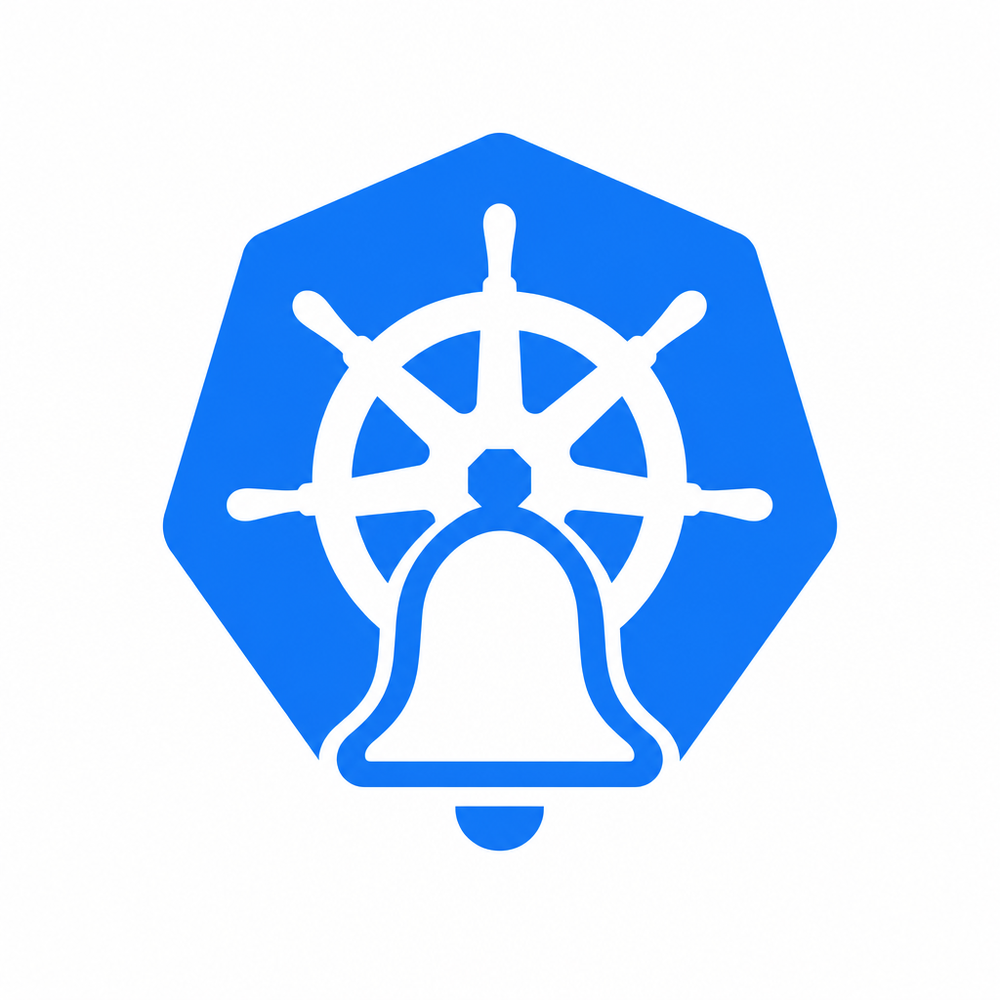

# alertkube

<!-- markdownlint-disable MD033 -->
<p align="center">
  
</p>
<!-- markdownlint-enable MD033 -->

> Kubernetes multi-resource alerting with deterministic routing, suppression, dedupe, resolves, and multi-sink delivery.

[](https://github.com/aryasoni98/alertkube/actions/workflows/ci.yml)
[](https://github.com/aryasoni98/alertkube/actions/workflows/codeql.yml)
[](https://scorecard.dev/viewer/?uri=github.com/aryasoni98/alertkube)
[](https://goreportcard.com/report/github.com/aryasoni98/alertkube)
[](LICENSE)

alertkube watches Pods, Nodes, Deployments, PVCs, Jobs, DaemonSets, StatefulSets, CronJobs, and HPAs. It classifies conditions as `critical`, `warning`, or `info`, deduplicates by `sha256(kind|namespace|name|reason)`, suppresses noise with silences/inhibitions/grouping, and sends alerts to Slack, PagerDuty, Teams, Opsgenie, Discord, Telegram, webhooks, or stdout.

## Install

Latest release: [v1.0.0](https://github.com/aryasoni98/alertkube/releases/latest).

```bash
helm upgrade --install alertkube oci://ghcr.io/aryasoni98/charts/alertkube --version 1.0.0 \
  --set cluster=my-cluster \
  --set slack.webhookUrl=https://hooks.slack.com/services/Change-Me
```

From a checkout:

```bash
helm upgrade --install alertkube ./helm \
  --set cluster=my-cluster \
  --set slack.webhookUrl=https://hooks.slack.com/services/Change-Me
```

Image:

```bash
docker pull ghcr.io/aryasoni98/alertkube:v1.0.0
```

## Key Capabilities

- **Watchers:** pod restarts/crashloops/OOM/SIGKILL/image-pull, node readiness/pressure/cordon, workload availability, failed jobs, missed CronJobs, maxed HPAs, lost/pending PVCs.
- **Routing:** match by severity, kind, namespace, reason, name, node, or labels.
- **Suppression:** fingerprint mute window, time-bounded silences, source/target inhibitions, optional storm grouping.
- **State:** ConfigMap persistence preserves active alerts and mute history across restarts.
- **Integrations:** Slack, PagerDuty, Teams, Opsgenie, Discord, Telegram, generic webhook, stdout, and Alertmanager webhook receiver.
- **Operations:** `/metrics`, `/healthz`, `/readyz`, `/api/alerts`, optional ServiceMonitor, Grafana dashboard.
- **Web console (read-only):** embedded single-binary UI on the metrics port — view active alerts, the loaded config (rules, grouping, routing, channels, silences), and suppression counts. Guarded by `api.token`; config stays source-of-truth in Git.

## Web Console

A read-only web console is embedded in the binary (no extra service, no npm) and served at `/` on the metrics port. It shows active alerts + recent history, the effective loaded config (alert patterns/rules, pattern grouping window, routing/channels, silences, enabled sources), and suppression counts scraped from `/metrics`. It also exposes `POST /api/config/validate` to check a candidate config against the startup validator before you commit it to Git.

Durable config (rules, grouping, routing, channels) is **never applied live** from the console — you author it (raw YAML or guided forms for rules/grouping/routing), the server renders the full merged config (preserving fields the forms don't model), and you review the diff and commit it to Git/ConfigMap. Git stays the source of truth. The one runtime mutation is **time-boxed silences**: an operator can mute a noisy alert immediately without a redeploy, and the silence survives a leader failover (persisted to the state ConfigMap). See [docs/design/web-ui-control-plane-prd.md](docs/design/web-ui-control-plane-prd.md) for the roadmap (UI-as-PR authoring, channel test-fire).

```bash
kubectl -n <ns> port-forward deploy/alertkube 9090:9090
open http://localhost:9090/   # paste ALERTKUBE_API_TOKEN (helm: api.token) when prompted
```

Auth model:

- **Read** endpoints (`/api/alerts`, `/api/config`, `GET /api/silences`) require `Authorization: Bearer <api.token>`.
- **Write** endpoints (`POST`/`DELETE /api/silences`, `POST /api/channels/test`) are gated by `api.authMode` and **fail closed**:
  - `token` (default) — a **separate** shared `api.writeToken`. With none set, runtime mutation is disabled (403) and the controller stays read-only.
  - `rbac` — each write's bearer token is a real Kubernetes token, validated by **TokenReview** and authorized by **SubjectAccessReview**, so the audit trail records a real username and access is managed with standard RBAC. Writes map to synthetic resources in the `alertkube.io` API group (`silences`: `create`/`delete`, `channels`: `create`). Grant a user access with an ordinary (Cluster)Role:

    ```yaml
    apiVersion: rbac.authorization.k8s.io/v1
    kind: ClusterRole
    metadata: {name: alertkube-silencer}
    rules:
    - apiGroups: ["alertkube.io"]
      resources: ["silences", "channels"]
      verbs: ["create", "delete"]
    ```

  Every mutation is audit-logged and counted (`alertkube_runtime_mutations_total`).
- **Channel test-fire** (`POST /api/channels/test`) sends one synthetic alert through a configured sink so you can confirm it works. It reuses the sink's already-loaded credentials — **no Secret is read or stored by the console**, so the zero-secrets-read posture is unchanged. Note it sends a *real* notification (PagerDuty/Opsgenie may open an incident).
- **Secret-reference channel test** (`POST /api/channels/test-ref`, opt-in) validates a channel whose credential lives in a Kubernetes Secret *before* you wire it: the controller reads the referenced key at send-time, sends one synthetic alert, and returns ok/fail — **the value is never stored or returned**. This is **off by default**; enabling `api.allowSecretRead=true` grants the controller `secrets: get` in its own namespace (a Role, never cluster-wide) and is the one place the zero-secrets-read posture bends. Supported types: slack (webhook), discord, teams, webhook, pagerduty, opsgenie.
- All data endpoints are served only by the elected leader; static assets carry no secrets. Lock the port down with `networkPolicy.enabled=true`.

## Minimal Config

```yaml
cluster: prod-us-east-1

behavior:
  muteSeconds: 600
  resolveTTLSeconds: 600
  startupGraceSeconds: 30

routing:
  - match: {severity: critical}
    sinks: [slack, pagerduty]
  - match: {severity: warning}
    sinks: [slack]
  - match: {severity: info}
    sinks: [slack]

inhibitions:
  - source: {kind: Node, reason: NodeNotReady}
    target: {kind: Pod}
    equal: [node]
    duration: 10m

silences:
  - matchers: {namespace: kube-system}
    until: "2026-06-15T00:00:00Z"
```

Useful Helm values:

```bash
--set pagerduty.routingKey=...
--set teams.webhookUrl=...
--set discord.webhookUrl=...
--set telegram.botToken=... --set telegram.chatId=...
--set opsgenie.apiKey=...
--set genericWebhook.url=...
--set receiver.enabled=true --set receiver.token=...
--set grouping.enabled=true
--set metrics.serviceMonitor.enabled=true
```

Slack note: modern incoming webhooks ignore per-channel routing. Use `slack.botToken` with `chat:write` for real severity/channel routing.

## Local Dev

```bash
export SLACK_WEBHOOK_URL=https://hooks.slack.com/services/xxxxx/xxxxx
export CLUSTER_NAME=my-cluster
go run .
```

## Documentation

- Manual: [alertkube Manual](https://aryasoni98.github.io/alertkube/manual/)
- Operations: [docs/OPERATIONS.md](docs/OPERATIONS.md)
- Troubleshooting: [docs/TROUBLESHOOTING.md](docs/TROUBLESHOOTING.md)
- Migration: [docs/MIGRATION-FROM-V1.md](docs/MIGRATION-FROM-V1.md)
- Testing: [docs/TESTING.md](docs/TESTING.md)
- Performance: [docs/PERFORMANCE.md](docs/PERFORMANCE.md)
- ADRs: [docs/decisions/](docs/decisions/)

Build docs locally:

```bash
make docs-serve
```

## Community

See [CONTRIBUTING.md](CONTRIBUTING.md), [GOVERNANCE.md](GOVERNANCE.md), [MAINTAINERS.md](MAINTAINERS.md), [ADOPTERS.md](ADOPTERS.md), [CODE_OF_CONDUCT.md](CODE_OF_CONDUCT.md), and [SECURITY.md](SECURITY.md).

Apache-2.0. See [LICENSE](LICENSE).
