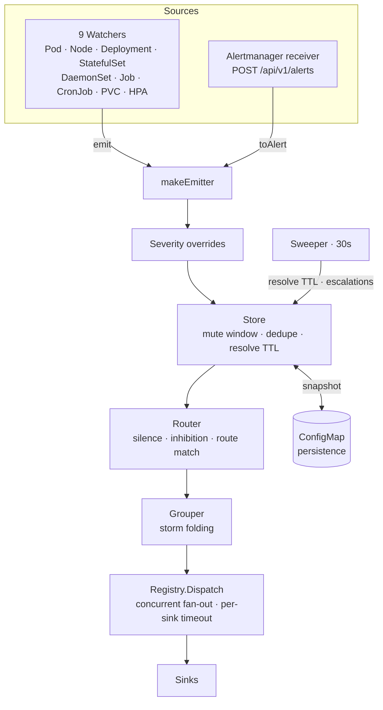

# Architecture

alertkube is a single Go binary and an event-to-alert pipeline: observe Kubernetes resources, detect bad conditions, dedupe/suppress, route, and deliver. It uses `client-go` informers directly; see [ADR-0001](https://github.com/aryasoni98/alertkube/blob/master/docs/decisions/0001-client-go-over-controller-runtime.md).

## The pipeline



| Stage | Package | Role |
| --- | --- | --- |
| Watch | `internal/watchers` | observe a resource, detect a failure condition, emit `*alert.Alert` |
| Identify | `internal/alert` | `ComputeFingerprint` (sha256) — stable identity / join key |
| Dedup | `internal/alert` (Store) | mute window, last-sent tracking, resolve TTL |
| Route | `internal/router` | silences, inhibitions, route → sink matching |
| Group | `internal/group` | storm folding (first passes, rest absorbed into a summary) |
| Dispatch | `internal/sinks` (Registry) | concurrent fan-out, per-sink rate limit + 15s timeout |
| Persist | `internal/persist` | ConfigMap snapshot, survives restarts |
| Sweep | `sweeper.go` | synthetic resolves, escalations, history cleanup |

Main wiring: `main()` -> `runController()` -> `buildWatchers()` / `buildSinks()` -> `makeEmitter()`.

## The fingerprint is the spine

Every downstream stage depends on the alert fingerprint:

```go
// sha256(kind|ns|name|reason), truncated to 12 hex chars
func ComputeFingerprint(kind Kind, ns, name, reason string) string
```

It keys dedupe, grouping, persistence, and PagerDuty/Opsgenie incident correlation. Changing it invalidates persisted state.

## The suppression triple

alertkube has four suppression mechanisms:

| Mechanism | Where | Keyed on | Purpose |
| --- | --- | --- | --- |
| **Mute window** | `Store` | fingerprint + time | don't resend the same alert within N seconds |
| **Silence** | `Router` | label matchers + `until` | suppress matching alerts until a timestamp |
| **Inhibition** | `Router` | source alert active | alert A suppresses dependent alert B |
| **Annotation silence** | `Router` | `alert-silence-until` | a workload silences itself (can be disabled) |

See [silence vs inhibition vs mute window](explanation/silence-vs-inhibition-vs-mute.md).

## Two sink families

All sinks implement `Name`, `Send`, and `Supports`. They split into two families:

- **HTTP-push sinks:** Slack, Teams, Discord, Telegram, generic webhook.
- **Stateful incident sinks:** PagerDuty and Opsgenie, keyed by fingerprint.

Stateful sinks must receive every resolve and must never receive grouped summaries. `internal/app/pipeline.go` enforces that split (`statefulSinks` + `dropStateful`/`keepStateful`).

## Durability

`internal/persist` snapshots active alerts and mute history to a ConfigMap. Restarts still send pending resolves and do not re-page standing conditions. Snapshots strip `Details` and enforce a size guard; see [ADR-0003](https://github.com/aryasoni98/alertkube/blob/master/docs/decisions/0003-configmap-state-backend.md).

## High availability

With `leaderElection.enabled=true`, a `coordination.k8s.io` Lease ensures only the leader dispatches. Followers serve metrics and health while `/readyz` stays 503 until they acquire leadership. See [run alertkube in HA](how-to/ha-leader-election.md).
