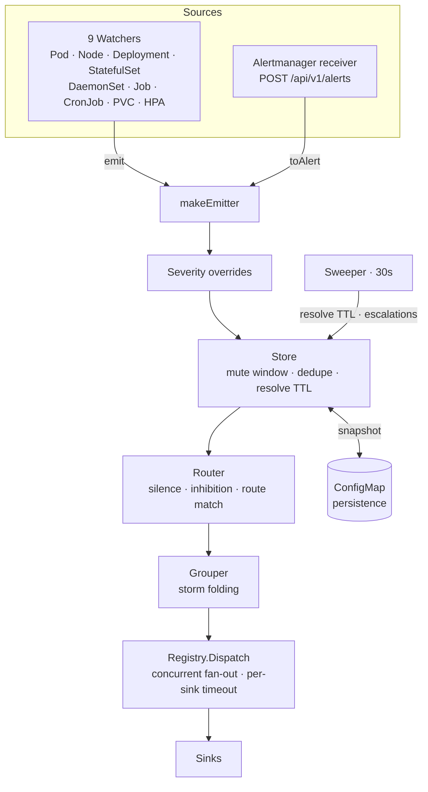

# Architecture

alertkube is a single Go binary that runs one control flow: **observe Kubernetes
resources → detect bad conditions → deduplicate and suppress → route → deliver**.
There is no reconcile loop and no custom resource (see
[ADR-0001](https://github.com/aryasoni98/alertkube/blob/master/docs/decisions/0001-client-go-over-controller-runtime.md));
it is an event-to-alert pipeline built directly on `client-go` informers.

## The pipeline



| Stage | Package | Role |
| --- | --- | --- |
| Watch | `internal/watchers` | observe a resource, detect a failure condition, emit `*alert.Alert` |
| Identify | `internal/alert` | `ComputeFingerprint` (sha256) — stable identity / join key |
| Dedup | `internal/alert` (Store) | mute window, last-sent tracking, resolve TTL |
| Route | `internal/router` | silences, inhibitions, route → sink matching |
| Group | `internal/group` | storm folding (first passes, rest absorbed into a summary) |
| Dispatch | `internal/sinks` (Registry) | concurrent fan-out, per-sink rate limit + 15s timeout |
| Persist | `internal/persist` | ConfigMap snapshot, survives restarts |
| Sweep | `sweeper.go` | synthetic resolves, escalations, history cleanup |

The wiring entry points are `main()` → `runController()` → `builders.go`
(`buildWatchers()` / `buildSinks()`) → `makeEmitter()`, the closure that strings
the middle stages together.

## The fingerprint is the spine

`Alert` is the most connected abstraction in the codebase because of one function:

```go
// sha256(kind|ns|name|reason), truncated to 12 hex chars
func ComputeFingerprint(kind Kind, ns, name, reason string) string
```

That fingerprint is the join key for **every** downstream stage — dedup,
suppression, grouping, persistence, and stateful-sink incident correlation. See
[the fingerprint & dedup model](explanation/fingerprint-and-dedup.md).

!!! note "Why it is load-bearing"
    Change the fingerprint definition and every suppression, dedup, and
    incident-correlation behavior shifts at once. That is why v0.2.0's switch
    from sha1 to sha256 was a noted breaking change — persisted snapshots from
    older versions no longer matched live alerts.

## The suppression triple

alertkube has three independent mute mechanisms (four, counting annotation
silences) that are easy to conflate but serve different purposes:

| Mechanism | Where | Keyed on | Purpose |
| --- | --- | --- | --- |
| **Mute window** | `Store` | fingerprint + time | don't resend the same alert within N seconds |
| **Silence** | `Router` | label matchers + `until` | suppress matching alerts until a timestamp |
| **Inhibition** | `Router` | source alert active | alert A suppresses dependent alert B |
| **Annotation silence** | `Router` | `alert-silence-until` | a workload silences itself (can be disabled) |

They are explained in depth in
[silence vs inhibition vs mute window](explanation/silence-vs-inhibition-vs-mute.md).

## Two sink families

All eight sinks implement the `Sink` interface (`Name` / `Send` / `Supports`),
but they split into two families with a critical invariant between them:

- **HTTP-push sinks** — Slack, Teams, Discord, Telegram, generic Webhook. Stateless;
  share the `internal/httpx` retry utility (exponential backoff + full jitter,
  `Retry-After` aware).
- **Stateful incident sinks** — PagerDuty, Opsgenie. Keyed by fingerprint; an
  incident stays open until the matching resolve arrives.

!!! warning "The dispatch invariant"
    Stateful sinks **must receive every resolve** (or incidents dangle) and
    **must never receive a group summary** (nothing would close it). This is
    enforced by `dropStateful()` / `keepStateful()` in `controller.go`.

## Durability

State persistence (`internal/persist`) snapshots active alerts and mute history
to a single ConfigMap so a restart still sends pending resolves and does not
re-page standing conditions. Two design choices keep it safe: capture the
`Store.Generation` counter before export (no lost mutation), and strip `Details`
to stay under the ~900 KiB guard. See
[ADR-0003](https://github.com/aryasoni98/alertkube/blob/master/docs/decisions/0003-configmap-state-backend.md).

## High availability

With `leaderElection.enabled=true` and `replicaCount: 2`, a `coordination.k8s.io`
Lease ensures only the leader dispatches. Followers stay Ready (standby is
healthy) and serve `/metrics`, but `/readyz` returns 503 until they acquire the
lease. See [run alertkube in HA](how-to/ha-leader-election.md).
