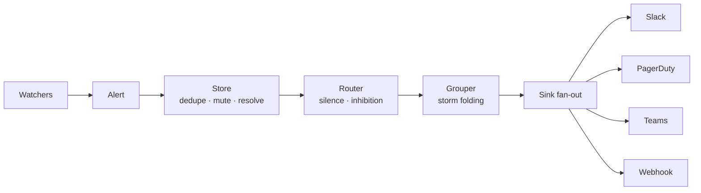

# alertkube

**Kubernetes multi-resource alerting controller** — severity tiers, multi-sink
routing, fingerprint dedupe, inhibitions, silences, storm folding, and Prometheus
metrics. Deterministic by design: every routing and suppression decision traces
back to your config and an alert's fingerprint.

alertkube watches Pods, Nodes, Deployments, StatefulSets, DaemonSets, Jobs,
CronJobs, PersistentVolumeClaims, and HPAs; classifies each event as
`critical` / `warning` / `info`; and routes it to one or more sinks — Slack,
PagerDuty, Microsoft Teams, Opsgenie, Discord, Telegram, a generic webhook, or
stdout.



## Find your way around

This documentation follows the [Diátaxis](https://diataxis.fr/) framework — four
kinds of docs for four kinds of need:

<div class="grid cards" markdown>

- :material-school: **[Tutorials](tutorials/install-with-helm.md)**

    Learning-oriented lessons. Start here if you are new — install with Helm and
    get your first alert.

- :material-wrench: **[How-to guides](how-to/add-a-silence.md)**

    Task-oriented recipes. Already running? Add a silence, configure inhibitions,
    tune storm folding, set up HA.

- :material-book-open-variant: **[Reference](reference/config-schema.md)**

    Lookup tables. The complete config schema, watcher conditions, sink
    credentials, and metrics.

- :material-lightbulb: **[Explanation](explanation/fingerprint-and-dedup.md)**

    Understanding-oriented. The fingerprint/dedup model, the suppression triple,
    and why alertkube is deterministic.

</div>

## Quick links

- [Architecture](architecture.md) — how the pipeline fits together
- [GitHub repository](https://github.com/aryasoni98/alertkube)
- [Operations guide](https://github.com/aryasoni98/alertkube/blob/master/docs/OPERATIONS.md)
- [Troubleshooting](https://github.com/aryasoni98/alertkube/blob/master/docs/TROUBLESHOOTING.md)
- [Contributing](https://github.com/aryasoni98/alertkube/blob/master/CONTRIBUTING.md)

## Install in one command

```bash
helm upgrade --install alertkube oci://ghcr.io/aryasoni98/charts/alertkube \
  --set cluster=my-cluster \
  --set slack.webhookUrl=https://hooks.slack.com/services/Change-Me
```

See the [install tutorial](tutorials/install-with-helm.md) for the full walkthrough.
