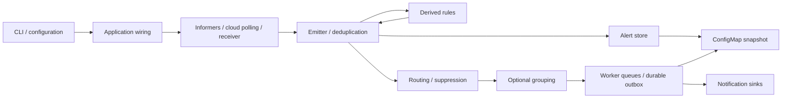

# Architecture and refactoring review

Reviewed 29 September 2026 on `refactor/modular-components-upgrade` for v2.0.0.
The repository already contained committed and uncommitted refactoring; that
work was reviewed and retained. Repository inventory, package relationships,
runtime paths, existing audit findings, build/release configuration, and baseline
tests were examined before this review made source changes. Historical local
`AUDIT.md` and `REFACTOR-PLAN.md` are leads, not current validation results.

## 1. Architecture summary

AlertKube is a modular Go controller, not a web application framework. Its 245 Go
files include 119 test files and 33,191 lines at review time. There are 29
production packages, plus shared test utilities. Go 1.27.1 builds the executable;
client-go owns Kubernetes informers and leader election. AWS, Azure, and GCP SDKs
provide cloud adapters. Controller-runtime is an integration-test dependency.

| Directory | Responsibility and relationships |
| --- | --- |
| `cmd/alertkube` | Small executable entry point delegating to `app.Run`. |
| `internal/app` | Composition root, CLI, lifecycle, leader election, dispatch/outbox, sweeper, and control API handlers. |
| `internal/alert` | Domain model, stable identities, matching, active/recent state, escalation marks, snapshot ownership. |
| `internal/config`, `env` | Named YAML sections, strict parsing, environment defaults, validation, maintenance schedules, shard scoping. Configuration is immutable for the process lifetime. |
| `internal/watchers`, `collectors`, `filter` | Nine Kubernetes watchers; informer event handling; bounded pod enrichment; namespace/name filtering. |
| `internal/sources/{aws,azure,gcp}` | Service-specific listing/evaluation over common polling, scope, pagination, and emit/resolve helpers. |
| `internal/router`, `group`, `rules`, `silence` | Routing/suppression, bounded storm summaries, count/all/absent rules, runtime silences. |
| `internal/sinks`, `httpx`, `textutil` | Ten sinks, retry/timeouts, circuit breakers, rate limits, credential handling, payload rendering, UTF-8 limits. |
| `internal/persist`, `shard` | ConfigMap snapshots and deterministic object ownership; separate state and Lease names per shard. |
| `api/v1alpha1`, `internal/crd` | Public Silence types and opt-in dynamic informer adapter. |
| `internal/authz`, `metrics`, `trace` | Bearer/RBAC checks, Prometheus metrics, health/readiness, leader handler slots, optional OpenTelemetry. |
| `internal/topology` | Tested topology query support; no production importer or active correlation engine. Retained as explicitly unfinished work. |
| `web` | Independent React 18 marketing site and changelog, loaded through pinned CDN scripts and Babel standalone; shared CSS/primitives and section components. No runtime controller UI or frontend package build. |
| `helm`, `examples` | Deployment, Secrets, RBAC, probes, monitoring resources, optional CRD, and supported sample configurations. |
| `docs`, `test`, `.github`, `scripts` | MkDocs manual, operational/design guidance, integration/E2E tests, CI/release workflows, and version/build helpers. |

Derived alerts are excluded from rule observation, so the runtime feedback does
not recurse. The Go import graph is acyclic. Adapter registries and narrow
interfaces already provide appropriate extension boundaries; another framework,
repository layer, or generic service abstraction would add little value.

Startup handles `version`/`validate` without a cluster, then loads config, shard
identity, clients, and listeners. A leader restores state before starting
producers. Receivers and API handlers occupy replaceable leader-scoped slots.
Dispatch uses fingerprint-affine queues and bounded sink calls. Shutdown removes
leader handlers, joins producers, drains dispatch, saves state, then releases
the Lease. Credentials remain in environment/Secrets, separate from YAML.

Conventions remain `gofmt`/`goimports`, explicit constructors, package-local
helpers, `klog`, standard-library tests, fake clients, and pinned CI tooling.

## 2. Problems discovered

The existing work addressed broad configuration coupling, repeated cloud
list/poll scaffolding, duplicated watcher handlers, mixed API wiring/handlers,
and a Slack-only template package. It also fixes snapshot ownership, incident
start-time loss, controller shutdown races, API routing/body limits, incomplete
cloud listings, watcher resync behavior, and unsafe sink error rendering.

This review reproduced four remaining defects with failing regression tests:

- Escalation marks changed persisted state without advancing its generation.
- YAML aliases/merges decoded values correctly but lost key-presence information,
  allowing environment defaults to overwrite explicit configuration.
- Additional YAML documents were silently ignored.
- Inhibition keys omitted rule identity and used ambiguous delimiters, allowing
  unrelated rules or values to suppress each other's alerts.

Release metadata still said 1.2.1 despite compatibility-changing work. The release
workflow used hosted runners, assumed Helm was installed, and lacked a validation
job before publication. The local image helper did not stamp its version.

## 3. Refactoring performed

The existing package structure is retained. Configuration uses named sections;
provider builders close over their own settings. API handlers, listener lifecycle,
and durable outbox responsibilities have separate files inside their packages.
Stores own mutable input/output collections. Shared source/watcher helpers replace
repeated control flow while service-specific evaluation remains local.

The additional fixes increment generation when escalation marks are added, use
the YAML library's resolved mappings for presence tracking, require one YAML
document, and key inhibitions by rule plus the existing escaped grouping key.
No production dependency was added for these fixes.

Version 2.0.0 is synchronized across the manifest, chart, image annotations,
website, installation docs, and scripts. The site preserves its historical 1.2.1
entry. The Go module and all local imports use the required `/v2` suffix, including
the Docker linker flag that stamps the binary version. The release workflow validates the tagged revision before publication and
uses the attached `self-hosted`, `Linux`, `X64` runner. Helm is installed explicitly
and its registry login is scoped to the runner's temporary directory and logged
out afterwards. Local builds pass their tag into the binary version flag.

## 4. Files removed

Relative to the pre-review committed tree:

- `internal/templates/blockkit.go` and its test moved into `internal/sinks` as
  `slack_blocks.go` and `slack_blocks_test.go`; all consumers are sink-local.
- `internal/app/event_emitter_test.go` was consolidated into pipeline tests.
- `internal/sources/aws/pollerr_test.go` was superseded by shared cloud error tests.

Earlier commits on this branch also removed the unreferenced historical
`scripts/land-audit-commits.sh`. Reference searches and test/dependency analysis
support these changes. Loaded web assets, examples, public CRD types, and
integration-only dependencies remain. Local historical audit scratch files remain
untracked and are not release inputs.

## 5. Components extracted

- API read/config, silence, and channel handlers; HTTP server lifecycle; outbox
  snapshot/replay operations.
- Named configuration sections and provider-specific builders.
- `sources.NewListSource` for Azure/GCP list-and-evaluate adapters.
- Shared informer `handleDiff` for add/update/delete/filter/recovery behavior.
- Slack payload rendering colocated with its only consumer.

Existing React section components are already separated. The actual UI duplication
was sink metadata, now shared by the `AK_SINKS` catalog; no UI rewrite was needed.

## 6. Shared utilities

Reused `maps.Clone`, `slices.Clone`, `textutil.Head`, canonical CRD identifiers,
namespace filters, shared HTTP delivery, and `Alert.GroupKey`. Provider helpers
centralize scoped source construction and bounded pagination. YAML alias/merge
resolution is delegated to the existing YAML dependency rather than implemented
as another parser. No general-purpose utility framework was introduced.

## 7. Performance improvements

Grouping retains at most 50 member names per bucket while counting every member.
Snapshots drop enrichment details before copying them. Snapshot writes are
mutation-gated. Cloud pagination and describe fan-out are bounded and cancellable;
CloudTrail lookups are paced per region. Shared HTTP clients reuse connections.

Removing the kubectl/PagerDuty dependency paths reduces build/runtime dependency
surface. Existing measurements in the changelog describe the binary-size change;
this review does not claim a new latency or throughput benchmark. Distinct group
count, outbox cardinality, and ConfigMap capacity remain workload-dependent limits.

## 8. Dependency cleanup

`k8s.io/kubectl` was used for formatting; a small local `text/tabwriter` renderer
preserves the output without importing a CLI stack. PagerDuty's small Events v2
payload uses the existing guarded HTTP helper, removing `go-pagerduty`. `go mod
tidy` removes the resulting unused transitive dependencies. Cloud SDKs, Slack,
Prometheus, OpenTelemetry, client-go, and the envtest dependency are retained.

`go mod tidy -diff` is empty and `go mod verify` passes. Govulncheck reports no
reachable or imported-package vulnerabilities. It reports module-level advisory
GO-2026-5932 for the unused `golang.org/x/crypto/openpgp` package; there is no fix
listed, and this controller does not import it.

## 9. Validation evidence

Fresh local checks on 29 September 2026:

| Check | Result |
| --- | --- |
| `go build ./...`, `go vet ./...` | Pass; package loading also rejects import cycles and broken imports. |
| `go test -race -count=1 -coverprofile=... ./...` | Pass, **84.7%** aggregate statement coverage. |
| Integration tests with real envtest API server/etcd, Kubernetes 1.34.1 | Pass with race detector. |
| Four fuzz targets | Pass, five-second smoke run per target plus existing corpus. |
| golangci-lint 2.13.2, including integration tag | **0 issues.** |
| deadcode 0.48.0 with tests | No unreachable functions. Runtime-only analysis identifies test helpers and unfinished correlation support; this is not proof all exports serve production. |
| Module verification/tidy and govulncheck | Results recorded above. |
| actionlint 1.7.12, shell syntax, version drift, diff whitespace | Pass. |
| Helm lint, six render scenarios, kubeconform | 54 resources: 50 valid, 0 invalid/errors, 4 optional CRs skipped without schemas. |
| Helm package | `alertkube-2.0.0.tgz` built. |
| Native linux/arm64 Docker build | Pass before the module-path-only update; final image verification runs in the release workflow. |
| MkDocs strict build | Pass, including v2 upgrade guide. |

Remote image/chart publication and Kubernetes E2E results are recorded in the
release/PR checks. Live cloud accounts and real notification credentials were
not exercised. Passing checks establish the tested contracts, not a proof of
zero defects or universal absence of duplication.

## 10. Remaining debt and recommendations

- Complete or explicitly remove topology correlation in a separate compatibility
  decision. It has tests and published data types but no production engine.
- Delivery remains at-least-once. Partial sink success and delayed resolve retries
  can still require per-sink acknowledgements and stronger ordering guarantees.
- ConfigMap capacity and wall-clock stale-snapshot checks are not distributed
  fencing. Test split-brain and sustained storm behavior before choosing a new
  state backend or increasing parallelism.
- In-flight API mutations can outlive a handler-slot clear. A future lifecycle
  change should join accepted mutations before final persistence.
- Broad-matcher detection is deliberately heuristic; its limitation is documented
  next to the probes. Avoid claiming exact regex-language equivalence.
- Expand live-provider/notification integration coverage and keep the Kubernetes
  E2E matrix current. Browser runtime JSX compilation remains a measured future
  optimization, not a reason to add a frontend build system now.

Follow the [v2 upgrade guide](docs/how-to/upgrade-to-v2.md): stricter configuration,
filter/matcher semantics, Silence scope, and fingerprint changes are intentional
compatibility changes already present in this branch. A major release makes them
explicit; this work must not be described as a behavior-identical patch release.
