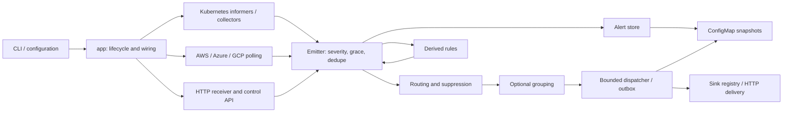

# Architecture and refactoring review

Review baseline: `39b813e` on `refactor/modular-components-upgrade`, 25 September
2026. Analysis preceded source changes. The pre-existing, untracked `AUDIT.md`
and `REFACTOR-PLAN.md` were treated as leads to verify, not as current test
results or instructions to rewrite working subsystems.

## Architecture and repository coverage

The baseline contains 354 tracked files, 221 Go files (106 test files), 29
production packages, and 414 test functions. Structural extraction covered all
233 Go, JSX, and shell files, producing 1,968 symbols/files and 6,126 structural
relationships. Go's package loader supplies the authoritative import graph;
the extracted graph is an analysis aid, not proof of runtime reachability.

AlertKube is a modular Go application. `cmd/alertkube/main.go` delegates to
`internal/app`, the composition root. Kubernetes client-go informers, cloud SDK
adapters, and an Alertmanager receiver produce the same `alert.Alert` model.
There is no application framework, database server, embedded browser console,
or frontend build dependency in the controller. Controller-runtime is used
only by the integration tests' envtest harness.

The runtime feedback from rules is intentional: derived alerts are excluded
from rule observation. The Go package graph is acyclic.

| Area | Responsibility and relationships |
| --- | --- |
| `cmd/alertkube`, `internal/app` | CLI commands, startup, leader election, sharding, controller wiring, dispatch, sweeps, and API handlers. |
| `internal/config`, `env` | YAML models, validation, legacy environment defaults, maintenance schedules, and per-shard persistence names. Configuration is immutable for a process lifetime (ADR-0005). |
| `internal/alert` | Canonical events, fingerprints, matching, active and recent state, escalation tracking, and snapshot schema. Most widely depended-on domain package. |
| `internal/watchers`, `collectors`, `filter` | Nine Kubernetes resource watchers; shared informer handlers and namespace filters; bounded asynchronous pod enrichment; log redaction and resource formatting. |
| `internal/sources` and its provider packages | Shared polling lifecycle, jitter, panic containment, emit/resolve helpers, and provider registries. AWS uses region clients and a shared page loop; Azure uses subscription listers; GCP uses a generic project source. |
| `internal/router`, `group`, `rules`, `silence` | First-match routing, suppression, grouping, count/all/absent rules, and runtime silence storage. |
| `internal/sinks`, `httpx`, `templates`, `textutil` | Ten registered delivery sinks, rate limits, circuit breakers, retry and egress protection, payload rendering, and UTF-8-safe truncation. Four chat sinks already share `webhookSink`. |
| `internal/persist`, `shard` | Gzip ConfigMap snapshots and deterministic object ownership. Each shard uses its own Lease and state object. |
| `api/v1alpha1`, `internal/crd` | Published Silence CR types and opt-in dynamic informer ingestion. |
| `internal/metrics`, `trace`, `authz` | Prometheus instrumentation, readiness/liveness, replaceable leader handlers, optional OTLP tracing, bearer comparison, and Kubernetes authorization. |
| `internal/topology` | Implemented topology queries with tests, but no production importer. Its planned correlation engine is absent. |
| `web` | Separate static marketing site and changelog, React 18, Babel standalone, Framer Motion, CSS tokens, shared primitives, and section components. Both HTML entry points load assets explicitly. Development tweak controls are used. |
| `helm`, `examples` | Deployment configuration, credentials, RBAC, networking, probes, optional CRD, monitoring resources, and sample configurations. |
| `docs` | MkDocs Material manual, operational guidance, architecture decisions, design proposals, and Grafana dashboard. Design proposals are not evidence of implemented functionality. |
| `test`, `.github`, `scripts`, `justfile` | Unit/race/fuzz/benchmark checks, envtest, kind smoke tests, Chainsaw scenarios, container/chart releases, version synchronization, and static-site publication. |

### Runtime and configuration contracts

- Startup dispatches `version` and `validate` without a cluster, then loads
  YAML/environment configuration, selects shard identity, initializes tracing
  and Kubernetes clients, and starts HTTP listeners outside the election gate.
- The leader restores state before starting producers. Informers resync every
  300 seconds; validation requires mute and resolution windows to exceed that
  interval. Cloud intervals must be below the resolution TTL.
- An emitter applies severity overrides, startup grace, deduplication, routing,
  optional grouping, and asynchronous delivery. Ephemeral events bypass active
  state and stateful incident sinks. Resolves bypass firing suppression.
- The dispatcher hashes fingerprints to worker queues to preserve local
  delivery order. Pending deliveries are persisted and replayed after restart.
  Delivery has nested request, sink, and dispatch timeouts.
- Runtime silences and the outbox share the alert snapshot. The sweeper saves
  only when generation counters change. Graceful shutdown drains producers,
  grouping, and dispatch before the final save.
- Credentials are environment/Secret values, not YAML fields. CLI, API,
  receiver, tracing, sharding, and delivery each have documented environment
  controls. YAML zero values currently trigger some environment fallbacks;
  changing that precedence would alter accepted configurations.
- Go conventions include narrow adapter interfaces, explicit constructors,
  init-time registries, standard-library tests, fake Kubernetes/cloud clients,
  `klog`, `gofmt`, and the pinned golangci-lint configuration. New layers or
  registries are unnecessary.

### Build and validation baseline

The controller builds with Go 1.27.1. `just` exposes build, race tests, lint,
fuzz, benchmarks, Helm, documentation, and version checks. Docker cross-compiles
a static binary for release architectures and uses a distroless runtime.
GitHub Actions separately exercise Go, envtest, kind, charts, security scanners,
release artifacts, and MkDocs publication. The website uses pinned CDN scripts
with integrity hashes and compiles JSX in the browser.

Before editing, `go test -race -count=1 ./...` passed across all Go unit-test
packages, golangci-lint reported zero issues, `go mod tidy -diff` was empty,
Helm lint passed, and version synchronization checks passed. These checks do
not prove that untested API wiring, leader handoff, or live cloud behavior is
correct.

## Problems established before changes

| Finding | Evidence / consequence | Treatment |
| --- | --- | --- |
| Anonymous configuration sections and broad provider inputs | Cloud constructors receive `*config.Config` although they use only one section. `config.go` mixes schema, parsing, defaults, and provider options. | Name the sections and narrow constructor inputs; preserve YAML tags and defaults. |
| Mixed API responsibilities | The 520-line `console.go` combines authentication, stores, rendering, Secret I/O, silences, channel tests, and profiling. | Split by endpoint responsibility within the existing package. |
| Versioned API paths disagree with handlers | Metrics registers `/api/v1/channels` and `/api/v1/silences/…`; channel handlers and silence deletion inspect `/api/…`. | Use the canonical route prefix and exercise the actual installed handlers through the production mux. |
| Outbox order is not durable | `PendingSnapshot` iterates a map and replay follows the resulting order, bypassing the local fire-before-resolve guarantee. | Preserve order by durable delivery ID, including snapshots produced by older builds. |
| Inconsistent ownership of mutable state | Store ingress/restore and snapshot export share alert pointers/maps; runtime silence copies share matcher maps. | Copy mutable data at ownership boundaries and test isolation. |
| Duplicated failure cleanup | `MarkFailed` duplicates forgetting but omits escalation cleanup. `Forget` does not advance the generation for mute-only deletions. | One cleanup path with correct mutation accounting. |
| Active alert age resets on unmuted repeat | Replacing an active fingerprint adopts the new `StartsAt`, defeating age-based escalation. | Retain the original active lifetime with regression coverage. |
| Group metadata is unbounded despite capped output | A storm retains every member although only the first 50 are rendered. Group identity sorts bare values, allowing swapped fields to collide. | Bound retained names while retaining the exact total; encode field identity. |
| Shutdown ownership is incomplete | Dispatcher closes its stop channel before checking whether it is already closed. Leader election launches the controller asynchronously and returns independently of its drain. | Make shutdown ownership explicit and test cancellation/election behavior. |
| Duplicate primitive implementations | Map copying, boolean rendering, namespace filtering, and Silence GVR declarations duplicate available standard-library or local functionality. | Reuse existing implementations and reduce unnecessary exports. |
| Obsolete migration script | `scripts/land-audit-commits.sh` stages a historical change set; no task or workflow invokes it. | Remove after reference verification. |
| Deployment/documentation drift | Chart configuration omits supported maintenance settings; contributor instructions describe old central registration; website metadata still advertises a removed embedded console. | Correct verified drift and add checks where useful. |

## Refactoring strategy

Retain the modular application and existing package boundaries. Apply cohesive
changes, run relevant regression tests and package checks after each group,
and finish with repository-wide validation. Keep externally visible config,
alert fingerprints, snapshot version, credentials, and sink payload contracts
compatible. Correct demonstrated wiring/lifecycle defects with regression
coverage rather than treating broken behavior as an intended feature.

No new production dependencies or speculative framework are needed. Stable
SDKs remain; the initial module tidy check found no unused dependencies.
Frontend components already have named boundaries despite sharing section
files. CSS and tweak assets are loaded and must not be removed based on
filenames or file length.

## Remaining compatibility and operational work

- Topology-aware correlation is unfinished: types, configuration, topology,
  tests, and design documents exist, but production wiring does not. Its
  published configuration and serialized alert field need an explicit
  implementation/deprecation decision before wholesale removal.
- Strict YAML decoding, explicit zero/false precedence, matcher validation,
  filter anchoring, external fingerprint namespacing, and an unambiguous
  fingerprint preimage require compatibility decisions and, for identities,
  snapshot/incident migration. Do not silently change them in a structural
  refactor.
- Review standing-condition semantics for Node/CronJob watchers and historical
  pod termination state with real informer resync scenarios. Pure evaluator
  tests do not cover all producer-to-resolution interactions.
- ConfigMap capacity and cross-leader stale writes remain operational limits.
  Resource-version retry prevents API update conflicts, not stale-state
  replacement or split-brain fencing. Joining an outgoing controller's drain
  does not prevent the next leader from acquiring the released Lease first.
- Initial outbox replay now preserves recorded order, but delayed resolve
  retries can still run after a newer firing. Delivery remains at-least-once;
  ordering across retries and partial per-sink success need separate designs.
- Live cloud partial-list behavior, SDK defaults, large log responses, sink
  credential error redaction, and rule/escalation retry semantics deserve
  focused integration/security work rather than speculative rewrites.
- Consider build-time JSX compilation only with a measured page-load need;
  introducing a frontend toolchain is not necessary to restructure the Go
  application. Static content and external links require ongoing release
  maintenance.

## Refactoring performed and components extracted

The implementation retains the existing modular Go architecture: domain state,
policy, adapters, and application wiring remain separate packages. No service
framework, repository layer, frontend build system, or production dependency
was introduced. Go configuration types changed internally; YAML keys, defaults,
normal alert fingerprints, snapshot version 1, environment names, and public
CRD types remain compatible.

| Change group | Final organization and behavior |
| --- | --- |
| Configuration and adapters | `config.go` contains shared schema, `cloud.go` contains provider sections, and `load.go` contains parsing/defaults. Named `Filters`, `Behavior`, `Channels`, `Receiver`, `Grouping`, `Persistence`, `AWS`, `Azure`, and `GCP` sections replace anonymous structs. Provider constructors take their own section; the registry's composition adapters receive the full config. |
| Watchers | Pod and generic resource watchers share `nsFilter`; pod evaluation retains its immutable behavior section instead of the entire config. Existing constructor conventions and registration remain. |
| API handlers | `console.go` retains authentication and wiring. `console_read.go`, `console_silences.go`, and `console_channels.go` own their respective operations. The production mux and handlers share `metrics.APIPrefix`; canonical channel routes and silence deletion work, and legacy paths retain 308 redirects. Oversized bodies return 413 before mutations. |
| HTTP serving | `metrics/server.go` owns listeners, readiness/liveness, routing, and handler replacement; `metrics.go` contains instrumentation. Receiver startup messages identify the actual API listener and canonical route. |
| Alert and silence ownership | Store ingress, restore, export, correlation data, runtime silences, and CRD silence caches copy mutable collections at ownership boundaries. Reminder deliveries preserve the incident's original start time. Failure cleanup uses `Forget`, including escalation cleanup and mutation accounting for mute-only records. |
| Grouping | Group identity encodes field names and escaped values. Buckets own summary identity, count every member, and retain only the 50 names that can appear in details. The first alert and existing summary wording/limits remain; normal incident fingerprints are unchanged. |
| Dispatch | `dispatcher_outbox.go` owns durable records and replay. Snapshots own their data and sort by delivery ID; replay also sorts older unordered snapshots. The shared enqueue path owns alerts/routes, and replay keeps fire-once failure behavior for events and summaries. All concurrent shutdown callers wait for the same bounded drain. |
| Controller lifecycle | Leader election joins controller cleanup, including cancellation before the leadership callback starts. Informer shutdown joins callbacks before draining enrichment. Cancellation during cache sync returns normally. Leader handlers and readiness clear before draining producers, dispatch, and the final state save. |
| CRD adapter | The dynamic informer uses `api/v1alpha1` resource identifiers instead of redeclaring them. Cached matcher maps are owned, and cancellation joins the informer factory without a misleading cache-sync error. |
| Deployment | Helm now renders maintenance windows and preserves an explicit false service-account token mount value. Chart CI checks both settings and the default true value. Generated chart documentation is current. |
| Website and release tooling | One `AK_SINKS` catalog drives the comparison table, architecture diagram, feature card, and counts for all ten sinks. Google Chat and Mattermost are included. Current marketing copy describes control APIs. JSON-LD is valid JSON and version checking parses it. Release markers sit outside the JSON using the supported [release-please block annotations](https://github.com/googleapis/release-please/blob/main/docs/customizing.md#updating-arbitrary-files). |
| Contributor documentation | Watcher/sink instructions describe self-registration and existing helpers. Broken maintainer-file links point to actual code ownership/release sources; no ownership assignments changed. Examples use supported Helm values overlays, and the local E2E command explicitly routes to stdout. The changelog records the user-visible fixes. |

Existing React components already separate the site's sections and reuse
primitives. No new UI component was extracted solely to reduce file length;
the concrete duplication was the sink data shared by three displays.

## Files and unused code removed

Only one tracked file was removed:

- `scripts/land-audit-commits.sh` (293 lines): a historical staging script with
  no references in active tasks, workflows, or source.

Removed or reduced unused/duplicate symbols include `cloneStringMap`,
`dropEscalationsLocked`, AWS `boolStr`, shell `expect_line` and an unused local,
the unused `controllerRuns` counter, redundant cloud goroutine parameters,
duplicate CRD Group/Version/Resource/GVR declarations, and two website sink
arrays. The default grouping field list is private and copied for each grouper.
The unused CODEOWNERS rule for the nonexistent maintainer file was removed;
the existing catch-all ownership rule remains.

Reference searches, the package graph, compilation, and the configured unused
analyzer support these removals. Both website entry points and their referenced
JSX/CSS/assets were exercised in Chromium. `internal/topology` is the one local
package outside the executable import graph: it remains explicitly tracked as
unfinished correlation work, with tests and compatibility-sensitive types/config.
Public CRD types, test helpers, fuzz targets, examples, and design documents were
not misclassified as dead application code. The two pre-existing untracked audit
documents were left untouched.

## Shared utilities and reuse

- Reused `maps.Clone` and `slices.Clone` instead of custom primitive copy loops.
- Reused `textutil.Head` for UTF-8-safe API field limits and `strconv.FormatBool`
  for S3 details.
- Reused the watcher's existing namespace filter, `api/v1alpha1` identifiers,
  `Store.Forget`, and dispatcher enqueue path.
- Exposed the existing API prefix to its handlers; added no general routing
  framework or alternate HTTP abstraction.
- Added small private clone operations for domain silence collections, where
  maps require ownership beyond copying the slice/struct.
- Centralized the static site's sink catalog and derived display names/counts.

## Performance and resource use

- Grouping retains at most 50 member names per bucket instead of one per alert.
  A regression test offers 10,000 absorbed alerts and verifies the exact total,
  bounded retained metadata, and existing summary/detail limits. Memory used
  for member names is independent of the storm size; the number of distinct
  groups is still workload-dependent.
- History/outbox snapshots discard enrichment details before cloning, avoiding
  allocation for maps that were immediately discarded.
- Group buckets no longer retain the first caller's full alert, logs, and maps.
- Explicit ownership adds necessary collection copies; ordered snapshots add
  sorting at persistence boundaries. These are correctness tradeoffs, not
  claimed CPU or throughput improvements. No cache, worker-pool redesign, or
  speculative frontend optimization was added.

## Dependency audit

`go.mod` and `go.sum` are unchanged. `go mod tidy -diff` is empty and
`go mod verify` passes. Direct SDK dependencies have active adapters;
controller-runtime is used by the integration-tagged envtest harness. Existing
transitive versions are selected by Go modules; deleting them manually would
not remove their consumers. No stable library was replaced unnecessarily.

With Go 1.27.1 and govulncheck 1.7.0, the scan reports no reachable vulnerabilities
and no affected imported packages. Its one module-only finding is
[GO-2026-5932](https://pkg.go.dev/vuln/GO-2026-5932), concerning the unmaintained
`golang.org/x/crypto/openpgp` family. Those packages are not imported by this
application; the advisory has no fixed version. Replacing the module's used
cryptography packages with an OpenPGP alternative would not address an
application dependency here.

## Final validation

The baseline had 414 test functions; the final tree has 435, including expanded
table-driven coverage. New regression cases were run against the affected
pre-fix behavior before their corresponding fixes. Each implementation group
passed scoped race tests, compilation, and the configured lint checks before
its signed conventional commit.

| Check | Result |
| --- | --- |
| `go test -race -count=1 -coverprofile=… -covermode=atomic ./...` | Passed; total statement coverage **71.1%**, above the repository's 66% gate. |
| `go build ./...`, CLI build, `go vet ./...` | Passed. |
| golangci-lint 2.13.2 | Passed with **0 issues**, including configured unused/static/type analyzers. |
| envtest with Kubernetes 1.34.1, `-race -tags integration -count=1` | Passed against a real API server and etcd. |
| Isolated kind cluster, Kubernetes 1.31.9 | Passed: chart startup, live versioned channel/silence APIs, authenticated receiver fire/resolve, real pod CrashLoopBackOff delivery and delete resolution, immediate shutdown persistence, two ready HA replicas, leader replacement, and silence restoration. Only stdout delivery was enabled. |
| Four existing fuzz targets, 30 seconds each | Passed: fingerprinting, regex matching, poisoned snapshot restore, and config loading. |
| Go module checks and govulncheck | Passed; module-only advisory qualified above. |
| Package import graph | 29 local packages, 65 local import edges, no cycles. `topology` is the documented dormant exception to executable reachability. |
| Docker release builds | Passed for **linux/amd64 and linux/arm64**; arm64 distroless image ran `version` and validated rendered configuration with networking disabled. |
| Helm lint and five CI render scenarios | Passed; kubeconform 0.6.7 validated 42 resources, with 0 invalid/errors. Three monitoring CRs were skipped under `-ignore-missing-schemas`. |
| Helm settings and examples | Exact rendered maintenance data, false/default-true token mounting, image version, four CLI example configs, and rendered chart config passed. The two documented example overlays also rendered and passed schema validation (16 resources). |
| helm-docs 1.14.2 | README regenerated from values/template. |
| MkDocs strict build | Passed. |
| Chromium desktop (1440px) and mobile (390px) | Home and changelog render; ten sinks agree across displays; valid JSON-LD; no JavaScript errors, failed local assets, or page-level horizontal overflow. |
| Release version checks | Current 1.2.1 passes. An isolated copy successfully bumped to `1.2.2-test.1`, updated publication date, and passed checks without changing workspace versions. |
| Formatting and diff checks | `gofmt`, shell syntax, and `git diff --check` passed. |

Validation is evidence for the exercised contracts, not a proof of zero defects.
Live AWS/Azure/GCP accounts and external notification services were not used.
The full CI Kubernetes matrix, Chainsaw OOM/image-pull scenarios, and sustained
production load still belong in the release validation process.

## Recommended next work

1. Prioritize lifecycle reliability: explicitly test in-flight HTTP mutations
   during shutdown, add cross-leader persistence fencing, and define ordering
   of delayed resolves versus newer firings.
2. Decide whether to finish or deprecate topology correlation, with a migration
   plan for accepted configuration and serialized fields.
3. Add real informer resync scenarios for persistent Node/CronJob conditions;
   expand cloud partial-page and escalation failure integration coverage.
4. Make configuration strictness, zero/false precedence, and fingerprint changes
   explicit compatibility projects with migration tests.
5. Measure memory under representative storm cardinality and ConfigMap limits
   before selecting another persistence backend or changing concurrency.
6. Retain current dependencies and frontend conventions until a measured need
   justifies replacement. Continue dependency scanning and static-site/browser
   checks during releases.
