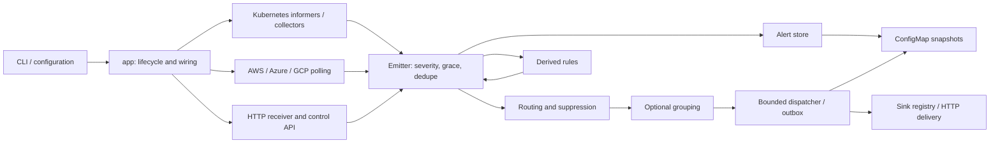

# Architecture and refactoring review

Review baseline: `39b813e` on `refactor/modular-components-upgrade`, 25 September
2026. Analysis preceded source changes. The pre-existing, untracked `AUDIT.md`
and `REFACTOR-PLAN.md` were treated as leads to verify, not as current test
results or instructions to rewrite working subsystems.

## Architecture and repository coverage

The baseline contains 354 tracked files, 221 Go files (106 test files), 29
production packages, and 414 test functions. Structural extraction covered all
233 Go, JSX, and shell files, producing 1,968 symbols/files and 6,126 structural
relationships. Go's package loader supplies the authoritative import graph;
the extracted graph is an analysis aid, not proof of runtime reachability.

AlertKube is a modular Go application. `cmd/alertkube/main.go` delegates to
`internal/app`, the composition root. Kubernetes client-go informers, cloud SDK
adapters, and an Alertmanager receiver produce the same `alert.Alert` model.
There is no application framework, database server, embedded browser console,
or frontend build dependency in the controller. Controller-runtime is used
only by the integration tests' envtest harness.

The runtime feedback from rules is intentional: derived alerts are excluded
from rule observation. The Go package graph is acyclic.

| Area | Responsibility and relationships |
| --- | --- |
| `cmd/alertkube`, `internal/app` | CLI commands, startup, leader election, sharding, controller wiring, dispatch, sweeps, and API handlers. |
| `internal/config`, `env` | YAML models, validation, legacy environment defaults, maintenance schedules, and per-shard persistence names. Configuration is immutable for a process lifetime (ADR-0005). |
| `internal/alert` | Canonical events, fingerprints, matching, active and recent state, escalation tracking, and snapshot schema. Most widely depended-on domain package. |
| `internal/watchers`, `collectors`, `filter` | Nine Kubernetes resource watchers; shared informer handlers and namespace filters; bounded asynchronous pod enrichment; log redaction and resource formatting. |
| `internal/sources` and its provider packages | Shared polling lifecycle, jitter, panic containment, emit/resolve helpers, and provider registries. AWS uses region clients and a shared page loop; Azure uses subscription listers; GCP uses a generic project source. |
| `internal/router`, `group`, `rules`, `silence` | First-match routing, suppression, grouping, count/all/absent rules, and runtime silence storage. |
| `internal/sinks`, `httpx`, `templates`, `textutil` | Ten registered delivery sinks, rate limits, circuit breakers, retry and egress protection, payload rendering, and UTF-8-safe truncation. Four chat sinks already share `webhookSink`. |
| `internal/persist`, `shard` | Gzip ConfigMap snapshots and deterministic object ownership. Each shard uses its own Lease and state object. |
| `api/v1alpha1`, `internal/crd` | Published Silence CR types and opt-in dynamic informer ingestion. |
| `internal/metrics`, `trace`, `authz` | Prometheus instrumentation, readiness/liveness, replaceable leader handlers, optional OTLP tracing, bearer comparison, and Kubernetes authorization. |
| `internal/topology` | Implemented topology queries with tests, but no production importer. Its planned correlation engine is absent. |
| `web` | Separate static marketing site and changelog, React 18, Babel standalone, Framer Motion, CSS tokens, shared primitives, and section components. Both HTML entry points load assets explicitly. Development tweak controls are used. |
| `helm`, `examples` | Deployment configuration, credentials, RBAC, networking, probes, optional CRD, monitoring resources, and sample configurations. |
| `docs` | MkDocs Material manual, operational guidance, architecture decisions, design proposals, and Grafana dashboard. Design proposals are not evidence of implemented functionality. |
| `test`, `.github`, `scripts`, `justfile` | Unit/race/fuzz/benchmark checks, envtest, kind smoke tests, Chainsaw scenarios, container/chart releases, version synchronization, and static-site publication. |

### Runtime and configuration contracts

- Startup dispatches `version` and `validate` without a cluster, then loads
  YAML/environment configuration, selects shard identity, initializes tracing
  and Kubernetes clients, and starts HTTP listeners outside the election gate.
- The leader restores state before starting producers. Informers resync every
  300 seconds; validation requires mute and resolution windows to exceed that
  interval. Cloud intervals must be below the resolution TTL.
- An emitter applies severity overrides, startup grace, deduplication, routing,
  optional grouping, and asynchronous delivery. Ephemeral events bypass active
  state and stateful incident sinks. Resolves bypass firing suppression.
- The dispatcher hashes fingerprints to worker queues to preserve local
  delivery order. Pending deliveries are persisted and replayed after restart.
  Delivery has nested request, sink, and dispatch timeouts.
- Runtime silences and the outbox share the alert snapshot. The sweeper saves
  only when generation counters change. Graceful shutdown drains producers,
  grouping, and dispatch before the final save.
- Credentials are environment/Secret values, not YAML fields. CLI, API,
  receiver, tracing, sharding, and delivery each have documented environment
  controls. YAML zero values currently trigger some environment fallbacks;
  changing that precedence would alter accepted configurations.
- Go conventions include narrow adapter interfaces, explicit constructors,
  init-time registries, standard-library tests, fake Kubernetes/cloud clients,
  `klog`, `gofmt`, and the pinned golangci-lint configuration. New layers or
  registries are unnecessary.

### Build and validation baseline

The controller builds with Go 1.27.1. `just` exposes build, race tests, lint,
fuzz, benchmarks, Helm, documentation, and version checks. Docker cross-compiles
a static binary for release architectures and uses a distroless runtime.
GitHub Actions separately exercise Go, envtest, kind, charts, security scanners,
release artifacts, and MkDocs publication. The website uses pinned CDN scripts
with integrity hashes and compiles JSX in the browser.

Before editing, `go test -race -count=1 ./...` passed across all Go unit-test
packages, golangci-lint reported zero issues, `go mod tidy -diff` was empty,
Helm lint passed, and version synchronization checks passed. These checks do
not prove that untested API wiring, leader handoff, or live cloud behavior is
correct.

## Problems established before changes

| Finding | Evidence / consequence | Treatment |
| --- | --- | --- |
| Anonymous configuration sections and broad provider inputs | Cloud constructors receive `*config.Config` although they use only one section. `config.go` mixes schema, parsing, defaults, and provider options. | Name the sections and narrow constructor inputs; preserve YAML tags and defaults. |
| Mixed API responsibilities | The 520-line `console.go` combines authentication, stores, rendering, Secret I/O, silences, channel tests, and profiling. | Split by endpoint responsibility within the existing package. |
| Versioned API paths disagree with handlers | Metrics registers `/api/v1/channels` and `/api/v1/silences/…`; channel handlers and silence deletion inspect `/api/…`. | Use the canonical route prefix and exercise the actual installed handlers through the production mux. |
| Outbox order is not durable | `PendingSnapshot` iterates a map and replay follows the resulting order, bypassing the local fire-before-resolve guarantee. | Preserve order by durable delivery ID, including snapshots produced by older builds. |
| Inconsistent ownership of mutable state | Store ingress/restore and snapshot export share alert pointers/maps; runtime silence copies share matcher maps. | Copy mutable data at ownership boundaries and test isolation. |
| Duplicated failure cleanup | `MarkFailed` duplicates forgetting but omits escalation cleanup. `Forget` does not advance the generation for mute-only deletions. | One cleanup path with correct mutation accounting. |
| Active alert age resets on unmuted repeat | Replacing an active fingerprint adopts the new `StartsAt`, defeating age-based escalation. | Retain the original active lifetime with regression coverage. |
| Group metadata is unbounded despite capped output | A storm retains every member although only the first 50 are rendered. Group identity sorts bare values, allowing swapped fields to collide. | Bound retained names while retaining the exact total; encode field identity. |
| Shutdown ownership is incomplete | Dispatcher closes its stop channel before checking whether it is already closed. Leader election launches the controller asynchronously and returns independently of its drain. | Make shutdown ownership explicit and test cancellation/election behavior. |
| Duplicate primitive implementations | Map copying, boolean rendering, namespace filtering, and Silence GVR declarations duplicate available standard-library or local functionality. | Reuse existing implementations and reduce unnecessary exports. |
| Obsolete migration script | `scripts/land-audit-commits.sh` stages a historical change set; no task or workflow invokes it. | Remove after reference verification. |
| Deployment/documentation drift | Chart configuration omits supported maintenance settings; contributor instructions describe old central registration; website metadata still advertises a removed embedded console. | Correct verified drift and add checks where useful. |

## Refactoring strategy

Retain the modular application and existing package boundaries. Apply cohesive
changes, run relevant regression tests and package checks after each group,
and finish with repository-wide validation. Keep externally visible config,
alert fingerprints, snapshot version, credentials, and sink payload contracts
compatible. Correct demonstrated wiring/lifecycle defects with regression
coverage rather than treating broken behavior as an intended feature.

No new production dependencies or speculative framework are needed. Stable
SDKs remain; the initial module tidy check found no unused dependencies.
Frontend components already have named boundaries despite sharing section
files. CSS and tweak assets are loaded and must not be removed based on
filenames or file length.

## Remaining compatibility and operational work

- Topology-aware correlation is unfinished: types, configuration, topology,
  tests, and design documents exist, but production wiring does not. Its
  published configuration and serialized alert field need an explicit
  implementation/deprecation decision before wholesale removal.
- Strict YAML decoding, explicit zero/false precedence, matcher validation,
  filter anchoring, external fingerprint namespacing, and an unambiguous
  fingerprint preimage require compatibility decisions and, for identities,
  snapshot/incident migration. Do not silently change them in a structural
  refactor.
- Review standing-condition semantics for Node/CronJob watchers and historical
  pod termination state with real informer resync scenarios. Pure evaluator
  tests do not cover all producer-to-resolution interactions.
- ConfigMap capacity and cross-leader stale writes remain operational limits.
  Resource-version retry prevents API update conflicts, not stale-state
  replacement or split-brain fencing.
- Live cloud partial-list behavior, SDK defaults, large log responses, sink
  credential error redaction, and rule/escalation retry semantics deserve
  focused integration/security work rather than speculative rewrites.
- Consider build-time JSX compilation only with a measured page-load need;
  introducing a frontend toolchain is not necessary to restructure the Go
  application. Static content and external links require ongoing release
  maintenance.

Implementation details, removals, performance changes, and final validation are
recorded below as each verified change group completes.
