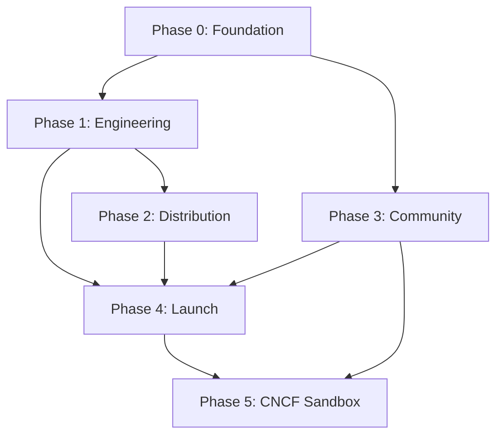

Here is a **phase → sub-phase → sub-sub-phase** build pipeline for alertkube, grounded in your analysis and the repo’s current state.

**Already in place:** Apache-2.0, `CONTRIBUTING.md`, `SECURITY.md`, `CODEOWNERS`, Dependabot, CodeQL, Trivy, cosign releases, Helm chart, Grafana dashboard, race detector + golangci-lint in CI, static docs under `docs/`.

**Gaps that block CNCF Sandbox:** CNCF CoC (you have Contributor Covenant), `GOVERNANCE.md`, `MAINTAINERS.md`, `ADOPTERS.md`, co-maintainer, docs site, Scorecard, DCO, verified Artifact Hub.

---

# alertkube Open-Source Build Pipeline



**Timeline anchor:** Months 0–2 → 2–4 → 3–5 → Aug–Oct → KubeCon CFP → Sandbox (~9–12 months total)

---

## Phase 0 — Foundation Hardening
**Goal:** Repo looks CNCF-ready; docs site live; security baseline measurable.  
**Window:** Now → ~8 weeks  
**Exit gate:** All health files present · Scorecard ≥ 7 · docs site live · OpenSSF badge “in progress”

### 0.1 — Governance & neutrality files

| Sub-sub-phase | Deliverable | Done when |
|---|---|---|
| **0.1.1** Replace CoC | `CODE_OF_CONDUCT.md` = [CNCF CoC verbatim](https://github.com/cncf/foundation/blob/main/code-of-conduct.md) | CNCF text adopted; enforcement contact listed |
| **0.1.2** Governance model | `GOVERNANCE.md` | Maintainer add/remove, voting, lazy consensus, neutrality statement, trademark note |
| **0.1.3** Maintainer registry | `MAINTAINERS.md` + sync `CODEOWNERS` | Single source of truth; GitHub teams if org exists |
| **0.1.4** Adopters seed | `ADOPTERS.md` | Template + “your org here” CTA; even self-use documented |
| **0.1.5** Decision log | `docs/decisions/` or ADRs | At least ADR-001: “stay on client-go until CRDs” |

### 0.2 — Contributor experience

| Sub-sub-phase | Deliverable | Done when |
|---|---|---|
| **0.2.1** DCO | `CONTRIBUTING.md` + DCO bot/check | Every PR requires `Signed-off-by:` |
| **0.2.2** Issue templates | `.github/ISSUE_TEMPLATE/` | bug · feature · good-first-issue |
| **0.2.3** PR hygiene | PR template update | checklist: tests, CHANGELOG, DCO |
| **0.2.4** Labels & triage | GitHub labels | `good first issue`, `help wanted`, `area/*` |
| **0.2.5** Starter backlog | 10–15 curated issues | Each has repro, scope, “first PR” hint |
| **0.2.6** Response SLA | `CONTRIBUTING.md` | “First response within 3 business days” published |

### 0.3 — Security & supply chain (incremental)

| Sub-sub-phase | Deliverable | Done when |
|---|---|---|
| **0.3.1** Private reporting | GitHub Security tab | Private vuln reporting enabled (SECURITY.md already good) |
| **0.3.2** OpenSSF Scorecard | `.github/workflows/scorecard.yml` + README badge | Workflow green; badge visible |
| **0.3.3** Branch protection | GitHub settings | `main` requires review + green CI |
| **0.3.4** Action hardening | Pin Actions to SHA; least-privilege `GH_TOKEN` | No floating `@v4` on critical jobs |
| **0.3.5** OpenSSF badge start | `bestpractices.dev` project | “Passing” checklist started; gaps tracked as issues |

### 0.4 — Documentation site (Diátaxis)

| Sub-sub-phase | Deliverable | Done when |
|---|---|---|
| **0.4.1** Tool choice | ADR: MkDocs Material *or* Docusaurus 3 | Decision recorded (MkDocs = speed; Docusaurus = i18n/versioning) |
| **0.4.2** Scaffold | `website/` or `docs-site/` | Local `make docs-serve` works |
| **0.4.3** Migrate content | Port README quickstart, OPERATIONS, TROUBLESHOOTING, MIGRATION | Old `docs/index.html` redirects or deprecates |
| **0.4.4** Diátaxis structure | Four top-level nav sections | Tutorials · How-to · Reference · Explanation |
| **0.4.5** Architecture page | Pipeline diagram (watchers → store → router → sinks) | Matches your DEEP_EXPLAIN flow |
| **0.4.6** Publish | GitHub Pages / Netlify | `docs.alertkube.io` or `alertkube.github.io` live |
| **0.4.7** README refresh | Badges: CI, Scorecard, license, Artifact Hub (placeholder) | Value prop in first screen + 60s quickstart |

**Diátaxis content map (sub-sub-phases under 0.4):**

```
Tutorials/
  0.4.T1  Install with Helm in 5 minutes
  0.4.T2  First alert to Slack
  0.4.T3  PagerDuty open/close by fingerprint

How-to/
  0.4.H1  Add a silence rule
  0.4.H2  Configure inhibition (Node → Pods)
  0.4.H3  Tune mute windows & storm folding
  0.4.H4  HA with leader election

Reference/
  0.4.R1  Config schema (ConfigMap keys)
  0.4.R2  Watcher conditions per Kind
  0.4.R3  Sink credentials & env vars
  0.4.R4  Metrics & Grafana dashboard

Explanation/
  0.4.E1  Fingerprint & dedup model
  0.4.E2  Silence vs inhibition vs mute window
  0.4.E3  Why no-AI / deterministic design
  0.4.E4  Comparison vs kwatch / Botkube / Robusta
```

### 0.5 — Release engineering baseline

| Sub-sub-phase | Deliverable | Done when |
|---|---|---|
| **0.5.1** Conventional Commits | `CONTRIBUTING.md` + commit lint (optional) | Commit message convention documented |
| **0.5.2** release-please | `.github/workflows/release-please.yml` | Semver tags + auto CHANGELOG sections |
| **0.5.3** Release notes | Goreleaser release body template | Human-readable notes per release |

---

## Phase 1 — Engineering Maturity
**Goal:** Confidence at scale; test matrix; documented framework decision.  
**Window:** Months 2–4 (overlaps Phase 0 tail)  
**Exit gate:** Green e2e on ≥3 K8s minors · coverage gate enforced · CRD decision ADR published · scale test report

### 1.1 — Testing pyramid

| Sub-sub-phase | Deliverable | Done when |
|---|---|---|
| **1.1.1** Unit coverage gate | CI fails if coverage &lt; threshold (e.g. 60% → 70%) | `coverage.out` enforced in CI |
| **1.1.2** Fuzz fingerprint | `go test -fuzz` on `ComputeFingerprint` | Fuzz target in `internal/alert/` |
| **1.1.3** Fuzz config parse | Fuzz `internal/config` | Invalid configs don’t panic |
| **1.1.4** Mock interfaces | gomock for k8s client boundaries | Watchers testable without cluster |
| **1.1.5** Integration: envtest | `envtest` for Store/Router/Persist | Runs in CI without kind |

### 1.2 — E2E & multi-version Kubernetes

| Sub-sub-phase | Deliverable | Done when |
|---|---|---|
| **1.2.1** chainsaw scaffold | `test/e2e/chainsaw/` | One smoke test: deploy → pod crash → stdout sink |
| **1.2.2** kind matrix | CI job: K8s 1.28 / 1.29 / 1.30 (adjust to supported range) | All green on PR |
| **1.2.3** Helm e2e | Install chart → assert Deployment ready | Part of chainsaw suite |
| **1.2.4** Sink e2e | Webhook sink receives alert payload | Mock receiver in cluster |
| **1.2.5** Upgrade test | Install vN → upgrade vN+1 → state preserved | Documented in CI nightly or weekly |
| **1.2.6** HA e2e | 2 replicas + leader election | Only leader dispatches |

### 1.3 — Framework & API decision (no code yet unless needed)

| Sub-sub-phase | Deliverable | Done when |
|---|---|---|
| **1.3.1** ADR: client-go vs controller-runtime | `docs/decisions/001-client-go.md` | “Stay on client-go while config is ConfigMap” |
| **1.3.2** CRD sketch (optional) | Design doc: `AlertRule`, `Silence`, `Inhibition` CRDs | OpenAPI field list; no impl required yet |
| **1.3.3** ConfigMap size audit | Measure snapshot size at N alerts | Doc: ~1 MiB ceiling + migration trigger |
| **1.3.4** State backend options | ADR for etcd CR vs external store | Trigger: snapshot &gt; 512 KiB sustained |

### 1.4 — Performance & reliability

| Sub-sub-phase | Deliverable | Done when |
|---|---|---|
| **1.4.1** Load test harness | Script: create 1k–5k pods with failures | Reproducible in kind |
| **1.4.2** Dedup/storm metrics | Validate `metrics` under load | No OOM; queue depth bounded |
| **1.4.3** Informer tuning | Document QPS/burst/resync flags | Defaults + tuning guide in docs |
| **1.4.4** Leader election tuning | Lease/renew durations documented | Failover &lt; 30s in HA test |
| **1.4.5** Benchmarks | `go test -bench` for fingerprint + router | Baseline in repo |

### 1.5 — Code quality gates

| Sub-sub-phase | Deliverable | Done when |
|---|---|---|
| **1.5.1** golangci-lint strict | Expand `.golangci.yml` | No new lint regressions |
| **1.5.2** Race always-on | Already in CI — add to e2e if applicable | Documented |
| **1.5.3** pre-commit (optional) | `.pre-commit-config.yaml` | Contributors can opt in |

---

## Phase 2 — Distribution & Discoverability
**Goal:** Installable, verifiable, findable.  
**Window:** Months 3–5 (overlaps Phase 1)  
**Exit gate:** Artifact Hub verified + signed charts · helm-docs/ct/kubeconform green · (OperatorHub only if CRDs)

### 2.1 — Helm & Artifact Hub

| Sub-sub-phase | Deliverable | Done when |
|---|---|---|
| **2.1.1** helm-docs | Auto-generated README in `helm/` | Values table always current |
| **2.1.2** chart-testing (ct) | `.github/workflows/helm.yml` expanded | Lint + install against kind |
| **2.1.3** kubeconform | Validate rendered manifests | CI step on chart templates |
| **2.1.4** Chart signing | cosign sign charts on release | Provenance doc in CONTRIBUTING |
| **2.1.5** artifacthub-repo.yml | Repo root metadata | Publisher ID registered |
| **2.1.6** Verified publisher | Artifact Hub claim flow | “Verified” badge on listing |
| **2.1.7** README badges | Artifact Hub + chart version badges | Visible on main README |

### 2.2 — Container & binary distribution

| Sub-sub-phase | Deliverable | Done when |
|---|---|---|
| **2.2.1** Multi-arch confirm | amd64 + arm64 in release | Goreleaser/buildx matrix |
| **2.2.2** SLSA provenance | Build provenance attestation | Level documented (target: SLSA Build L2+) |
| **2.2.3** SBOM publish | SPDX per release (may exist) | Linked in release assets |
| **2.2.4** distroless audit | Nonroot, read-only FS | Documented in security page |

### 2.3 — OperatorHub path (conditional — only if CRDs ship)

| Sub-sub-phase | Deliverable | Done when |
|---|---|---|
| **2.3.1** Kubebuilder scaffold | `api/`, `controllers/` | CRD generation works |
| **2.3.2** OLM bundle | CSV + bundle image | `operator-sdk bundle` |
| **2.3.3** community-operators PR | Package in redhat-openshift/community-operators | Listing live |
| **2.3.4** Capability level doc | Level 2–3 narrative | Matches implemented automation |

**Skip 2.3 entirely** if Phase 1 ADR keeps ConfigMap-only config.

### 2.4 — Optional: kubectl plugin (Krew)

| Sub-sub-phase | Deliverable | Done when |
|---|---|---|
| **2.4.1** Plugin commands | `kubectl alertkube status\|silences\|rules` | Thin client over API or ConfigMap |
| **2.4.2** krew-index PR | Plugin manifest | `kubectl krew install alertkube` works |

### 2.5 — Observability pack

| Sub-sub-phase | Deliverable | Done when |
|---|---|---|
| **2.5.1** Grafana dashboard polish | `docs/grafana-dashboard.json` | Linked from docs site |
| **2.5.2** Prometheus rules (optional) | `helm/templates/prometheusrule.yaml` | alertkube self-health alerts |
| **2.5.3** Runbook | How-to: “alertkube not dispatching” | In docs How-to section |

---

## Phase 3 — Community Building
**Goal:** Not a solo-maintainer project; recurring contributors.  
**Window:** Months 4–10, **peak Aug–Oct (Hacktoberfest)**  
**Exit gate:** ≥2 maintainers (different employers) · ≥5 external contributors · Hacktoberfest participation

### 3.1 — Platforms

| Sub-sub-phase | Deliverable | Done when |
|---|---|---|
| **3.1.1** GitHub Discussions | Categories: Q&A, Ideas, Show & tell | Linked from README |
| **3.1.2** Discord server | #general #help #dev #announcements | Moderation doc + CoC link |
| **3.1.3** Kubernetes Slack | Request channel via `#slack-admins` | Or participate in SIG-observability threads |
| **3.1.4** CNCF Slack | After Sandbox acceptance | Service desk request |

### 3.2 — Contributor growth

| Sub-sub-phase | Deliverable | Done when |
|---|---|---|
| **3.2.1** all-contributors bot | `.all-contributorsrc` | Recognize docs/review/triage |
| **3.2.2** Hacktoberfest prep | Label 20+ `good first issue` by July | Each issue &lt; 1 evening of work |
| **3.2.3** Hacktoberfest run | October focus | ≥10 merged external PRs target |
| **3.2.4** Monthly triage | Calendar ritual | Stale issues labeled/closed gently |
| **3.2.5** Contributor ladder | `CONTRIBUTING.md` section | Contributor → reviewer → maintainer path |

### 3.3 — Co-maintainer recruitment (critical path)

| Sub-sub-phase | Deliverable | Done when |
|---|---|---|
| **3.3.1** Maintainer job description | What you need: reviews, releases, community | In GOVERNANCE.md |
| **3.3.2** Outreach list | 10 targets: SRE friends, K8s meetups, LFX | Spreadsheet / issue |
| **3.3.3** Onboard co-maintainer | GitHub admin + CODEOWNERS | **Different employer than you** |
| **3.3.4** Shared ownership | Release rotation doc | Either maintainer can cut a release |

### 3.4 — Internationalization (if Docusaurus chosen)

| Sub-sub-phase | Deliverable | Done when |
|---|---|---|
| **3.4.1** i18n scaffold | `i18n/pt`, `hi`, `id` or similar | Build works |
| **3.4.2** Translate quickstart | 2–3 high-growth locales | Community PRs welcome |
| **3.4.3** i18n CONTRIBUTING | How to add a language | Documented |

### 3.5 — Funding (non-monetization)

| Sub-sub-phase | Deliverable | Done when |
|---|---|---|
| **3.5.1** GitHub Sponsors | Profile enabled | README sponsor link |
| **3.5.2** Open Collective (optional) | OSC fiscal host | Expense transparency |
| **3.5.3** Grant pipeline | NLnet / Alpha-Omega / STA applications | Tracker issue with deadlines |

---

## Phase 4 — Public Launch
**Goal:** Awareness, adopters, conference presence.  
**Window:** Align to KubeCon CFP + event calendar  
**Exit gate:** Launch posts live · Killercoda demo · CFP submitted · ≥3 documented adopters

### 4.1 — Positioning & content

| Sub-sub-phase | Deliverable | Done when |
|---|---|---|
| **4.1.1** Comparison matrix | docs: alertkube vs kwatch/Botkube/Robusta/Alertmanager | **Lead with no-AI determinism** |
| **4.1.2** Trust narrative | Blog: “Why we didn’t add an LLM” | Published on docs blog or dev.to |
| **4.1.3** Architecture deep-dive | Fingerprint + suppression triple (from DEEP_EXPLAIN) | Explanation doc on site |
| **4.1.4** Adopter case studies | 2–3 entries in ADOPTERS.md | Name + use case + quote |

### 4.2 — Launch channels

| Sub-sub-phase | Deliverable | Done when |
|---|---|---|
| **4.2.1** Show HN | Post + monitor comments 48h | Link to quickstart |
| **4.2.2** r/kubernetes | Follow sub rules; technical post | Posted |
| **4.2.3** CNCF blog pitch | “Deterministic K8s alerting” angle | Submitted to CNCF editorial |
| **4.2.4** KubeCon CFP | Lightning talk or maintainer track | Submitted before deadline |
| **4.2.5** Meetup talks | Local K8s/CNCF meetups | 1–2 talks scheduled |

### 4.3 — Interactive demo

| Sub-sub-phase | Deliverable | Done when |
|---|---|---|
| **4.3.1** Killercoda scenario | Install → break pod → see Slack/webhook | Public URL |
| **4.3.2** README embed | “Try in browser” button | Clickable from README |
| **4.3.3** Demo video (optional) | 3-min screen recording | YouTube + docs embed |

### 4.4 — Adopter pipeline

| Sub-sub-phase | Deliverable | Done when |
|---|---|---|
| **4.4.1** Adopter template PR | `ADOPTERS.md` format | Logo + one-liner |
| **4.4.2** Outreach | Ask happy users / Discord members | ≥3 independent orgs |
| **4.4.3** Production stories | Short “how we use alertkube” | Linked from adopters page |

---

## Phase 5 — CNCF Sandbox Candidacy
**Goal:** Neutral governance + TOC approval.  
**Window:** After Phases 0–4 gates (target ~9–12 months from start)  
**Exit gate:** Application submitted · ≥2 maintainers · governance final · adopters doc · IP readiness

### 5.1 — Pre-submission checklist

| Sub-sub-phase | Deliverable | Done when |
|---|---|---|
| **5.1.1** Governance final review | `GOVERNANCE.md` | Neutrality, LF trademark willingness explicit |
| **5.1.2** Maintainers | `MAINTAINERS.md` | ≥2, ≥2 organizations |
| **5.1.3** Adopters | `ADOPTERS.md` | ≥3 independent (Incubation bar preview) |
| **5.1.4** IP / trademark | Domain, logo, repo ownership | Willing to transfer to LF documented |
| **5.1.5** Duplication check | CNCF landscape scan | No unresolved overlap with existing CNCF project |
| **5.1.6** Sandbox application | Issue in `github.com/cncf/sandbox` | Submitted in review batch |

### 5.2 — Parallel Incubation prep (start at Sandbox, don’t wait)

| Sub-sub-phase | Deliverable | Done when |
|---|---|---|
| **5.2.1** OpenSSF Passing badge | `bestpractices.dev` | Badge earned |
| **5.2.2** DevStats readiness | CNCF onboarding tasks | Post-acceptance |
| **5.2.3** Security audit | CNCF/LF audit when eligible | Scheduled |
| **5.2.4** LFX Mentorship | Mentee project proposal | 1 cohort application |

---

# Master dependency graph (critical path)

```
0.1 Governance files ──────────────────────────────┐
0.3 Scorecard + branch protection ─────────────────┤
0.4 Docs site ─────────────────────────────────────┼──► 3.3 Co-maintainer ──► 5.1 Sandbox app
1.2 E2E multi-version ──► 2.1 Artifact Hub ────────┤
4.4 Adopters (≥3) ─────────────────────────────────┘
```

**Single biggest blocker:** `3.3` co-maintainer from a different employer — start outreach in Phase 0, not Phase 3.

---

# 90-day sprint (what to do first)

| Week | Focus | Sub-sub-phases |
|------|--------|----------------|
| 1–2 | Governance | 0.1.1–0.1.4, 0.2.1 |
| 3–4 | Security + README | 0.3.1–0.3.4, 0.4.7 |
| 5–8 | Docs site MVP | 0.4.1–0.4.6, tutorials 0.4.T1–T2 |
| 9–10 | Scorecard + release-please | 0.3.2, 0.5.2 |
| 11–12 | E2E smoke + co-maintainer outreach | 1.2.1, 3.3.1–3.3.2 |

---

# Decision gates (when to branch the pipeline)

| Trigger | Action | Affects |
|---------|--------|---------|
| ConfigMap snapshot &gt; ~512 KiB | Accelerate **1.3.4** + **2.3** CRD/OLM path | Phase 1 & 2 |
| Can’t recruit co-maintainer by month 6 | **Delay Phase 5**; expand Phase 3 | Timeline +6 months |
| Competitor ships deterministic multi-resource alert | Refresh **4.1.1** comparison; double down on fingerprint/sinks | Phase 4 only |
| Hacktoberfest &lt; 5 external PRs | Add bounty/sponsor; simplify good-first issues | Phase 3 |

---

I can turn this into a tracked artifact next — e.g. `docs/ROADMAP.md` with checkboxes, GitHub milestone issues per sub-sub-phase, or a Kanban-style project board. Say which format you want.