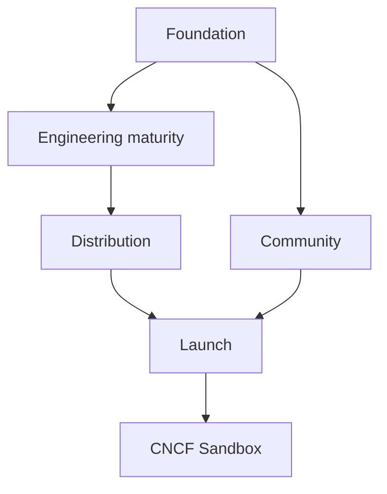

# Roadmap

This is the short working roadmap toward a mature open-source project and a possible CNCF Sandbox application.

## Current Baseline

Already in place: Apache-2.0, governance files, DCO, CodeQL, Dependabot, Trivy, OpenSSF Scorecard, cosign releases, Helm chart, Grafana dashboard, docs site, ADRs, fuzz tests, coverage gate, e2e scaffold, and release-please.

Main blockers before CNCF Sandbox:

- Recruit at least one additional maintainer from a different organization.
- Build independent adopter evidence in `ADOPTERS.md`.
- Verify Artifact Hub publisher/listing.
- Keep e2e coverage green across supported Kubernetes versions.
- Continue OpenSSF Best Practices work.

## Phases

## Foundation

Goal: make the repository easy to trust and contribute to.

Done or mostly done:

- Governance, maintainers, adopters, conduct, security, contributing, and ADR docs.
- DCO and contributor workflow.
- MkDocs Material site organized by Tutorials, How-to, Reference, Explanation.
- Security and supply-chain workflows.
- Conventional Commit/release-please flow.

Remaining:

- OpenSSF Best Practices badge.
- Final hosting decision for landing page vs manual.
- Keep health docs current as releases ship.

## Engineering Maturity

Goal: prove alertkube is reliable under real cluster behavior.

Priorities:

- Keep unit, race, fuzz, and coverage gates green.
- Expand e2e from scaffold to real install, alert, resolve, upgrade, and HA flows.
- Maintain benchmark baselines for fingerprinting, matching, routing, and grouping.
- Measure ConfigMap snapshot size under load; revisit ADR-0003 if sustained snapshots exceed 512 KiB.
- Revisit ADR-0001 only if routing, silences, or inhibitions move from ConfigMap to CRDs.

## Distribution

Goal: make installs verifiable and discoverable.

Priorities:

- Verify Artifact Hub publisher and listing.
- Keep chart docs generated and drift-checked.
- Keep chart-testing, kubeconform, and Helm install checks in CI.
- Publish multi-arch images, SBOMs, signatures, and release notes consistently.
- Consider OperatorHub only if CRDs become part of the product.

## Community

Goal: reduce single-maintainer risk.

Priorities:

- Recruit a co-maintainer from a different employer.
- Keep `good first issue` and `help wanted` labels stocked with small tasks.
- Use GitHub Discussions for Q&A and design ideas.
- Document monthly triage/release rituals.
- Add real adopters and short usage notes to `ADOPTERS.md`.

## Launch

Goal: explain the project clearly and gather feedback.

Priorities:

- Keep comparison docs honest: alertkube complements Alertmanager; it is not a metrics engine or ChatOps/remediation platform.
- Publish a concise deterministic-alerting story.
- Create a small demo path: install, break a pod, receive alert, resolve.
- Submit talks/posts after e2e and adopter evidence are stronger.

## CNCF Sandbox Checklist

Before applying:

- At least two maintainers from different organizations.
- Public governance and maintainer process.
- Clear adopter evidence.
- Healthy security posture and release process.
- No unresolved overlap story with existing CNCF projects.
- Willingness to transfer trademarks/domains/assets if accepted.

## Decision Gates

| Trigger | Action |
| --- | --- |
| ConfigMap snapshot sustained above 512 KiB | Evaluate CRD/status or external store; supersede ADR-0003. |
| CRDs become product direction | Revisit client-go vs controller-runtime; supersede ADR-0001 if needed. |
| Co-maintainer not found by month 6 | Delay Sandbox work and focus on contributor growth. |
| Artifact Hub verification blocked | Prioritize chart metadata/publisher claim before launch. |