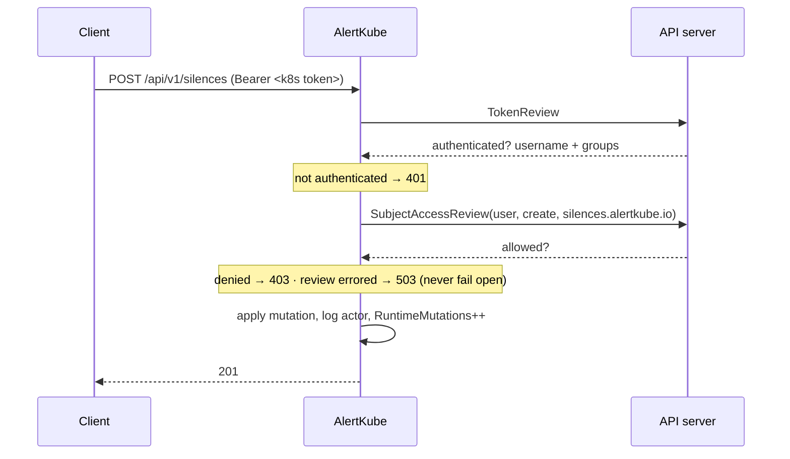

# Security architecture

AlertKube's security posture in one sentence: **a default install reads
Kubernetes objects, holds no secrets it did not need, and exposes no write path
at all.** Everything beyond that is opt-in and fails closed.

## Threat model

AlertKube is worth attacking for three reasons, and the design answers each:

| Goal of an attacker | Why it is valuable | Control |
| --- | --- | --- |
| Read alert contents | Alerts describe your cluster's weak points in real time | Read token on every data route; optional separate listener to firewall |
| Inject or resolve alerts | A forged resolve closes a real incident; forged alerts cause alert fatigue | Receiver requires a bearer token unless explicitly opted out |
| Silence alerts | A silence is a licence to be attacked unobserved | Writes fail closed; RBAC mode ties them to Kubernetes identity; every mutation is counted and logged |

Out of scope: AlertKube trusts the API server and the sinks' TLS endpoints. It
is not a defence against a compromised control plane.

## Authentication and authorization

Two independent gates. Reads and writes are separate on purpose — a dashboard
that lists alerts should not be able to silence them.

### Read path

`ALERTKUBE_API_TOKEN` (Helm: `api.token`) guards every data route, compared in
constant time. If unset, reads are **unauthenticated** and the controller logs a
loud warning at startup naming the address. That is a deliberate escape hatch
for operators who firewall the port instead, not a default to leave alone.

### Write path

Selected by `ALERTKUBE_AUTH_MODE`:

**Token mode (default).** Writes require `ALERTKUBE_API_WRITE_TOKEN`. **If it is
unset, every mutation returns 403** — a default install has no write path at
all. The audit identity falls back to the `X-Alertkube-User` header, which is
advisory only and sanitized before logging.

**RBAC mode (`ALERTKUBE_AUTH_MODE=rbac`).** The write token is ignored. Each
request's bearer token is validated by **TokenReview**, then authorized by
**SubjectAccessReview** against the `alertkube.io` API group:

```
POST   /api/v1/silences       → create silences.alertkube.io
DELETE /api/v1/silences/{id}  → delete silences.alertkube.io
POST   /api/v1/channels/test  → create channels.alertkube.io
```



Grant it with ordinary RBAC — no AlertKube-specific concept:

```yaml
kind: Role
rules:
  - apiGroups: ["alertkube.io"]
    resources: ["silences"]
    verbs: ["create", "delete"]
```

A failed authorization *check* returns **503**, not 403. An unreachable API
server must not be indistinguishable from a denial.

### Audit

Every mutation increments `alertkube_runtime_mutations_total{action}` and logs
the acting username. Runtime state lives outside Git, so a non-zero value is
the signal to go read the logs. Free-text fields are stripped of control
characters and length-capped before logging (log-injection defence).

## Secret handling

**Sink credentials are read from the environment on every `Send`,** never cached
at construction. A rotated Secret takes effect on the next alert without a
restart — and the credential is never copied into config, logs, or the
`/api/v1/config` response. `SinkConfig` deliberately carries only non-secret
process wiring.

**AlertKube does not read Kubernetes Secrets by default.** The one feature that
can is the Secret-reference channel test, and it is triple-gated:

1. `ALERTKUBE_ALLOW_SECRET_READ=true` (Helm: `api.allowSecretRead`), which also
   grants `secrets:get` scoped to the controller's own namespace
2. `POD_NAMESPACE` must be set — the reader is namespace-scoped, so it cannot
   reach a Secret elsewhere
3. The request must pass the write gate

The value is injected for a single test send and **never returned to the
client**; a read failure names only the reference, never the contents. With the
opt-in off the endpoint returns 403.

## Profiling surface

`/debug/pprof` can dump heap and goroutine state and burn CPU on demand. It is
disabled by default and **refuses to expose itself unauthenticated**: with
`ALERTKUBE_ENABLE_PPROF=true` but no read token, it logs a warning and stays
off. The route answers 503 until a handler is installed.

## Network exposure

Set `apiAddr` to split the listeners:

| Listener | Serves | Exposure |
| --- | --- | --- |
| `metricsAddr` | `/metrics`, `/healthz`, `/readyz` | Safe for Prometheus and the kubelet |
| `apiAddr` | `/api/v1/*` | Sensitive — firewall it |

Enable the shipped NetworkPolicy (`networkPolicy.enabled=true`, see
`helm/templates/networkpolicy.yaml`) so only your monitoring namespace can
reach the data plane. Egress still needs to reach your sinks and the API
server.

Leader-scoped routes answer **503** on a follower and on a demoted leader
(`ClearLeaderHandlers`). That matters for the receiver: a demoted leader that
kept answering `202` would accept alerts into a store nothing will drain.

## RBAC requirements

| Resource | Verbs | Needed for | When |
| --- | --- | --- | --- |
| pods, nodes, deployments, statefulsets, daemonsets, jobs, cronjobs, hpa, pvc | get, list, watch | Core watching | Always |
| events | list, watch | Alert enrichment | Always |
| pods/log | get | Enrichment (previous container logs) | Always |
| configmaps | get, create, update | State persistence | `persistence.enabled` |
| leases (coordination.k8s.io) | get, create, update | Leader election | `leaderElection.enabled` |
| silences.alertkube.io | get, list, watch | Silence CRD | `crds.silences.enabled` |
| tokenreviews, subjectaccessreviews | create | RBAC auth mode | `api.authMode=rbac` |
| secrets | get (own namespace) | Secret-reference channel test | `api.allowSecretRead` |
| replicasets, services | get, list, watch | Correlation topology | Correlation (in progress) |

`pods/log` is the widest grant in the default set — it can read application log
output. Set `--watch-namespace` to scope the controller to a single namespace
and drop to a Role instead of a ClusterRole; this disables node alerts, which
are cluster-scoped.

## Supply chain

Signed multi-arch images and SBOMs on every tagged release; CodeQL, Trivy,
dependency-review, and OpenSSF Scorecard in CI; Dependabot for gomod, Actions,
and Docker. The image is distroless/static running as non-root uid 65532.

Report vulnerabilities per [SECURITY.md](https://github.com/aryasoni98/alertkube/blob/master/SECURITY.md).
Do not open a public issue.
