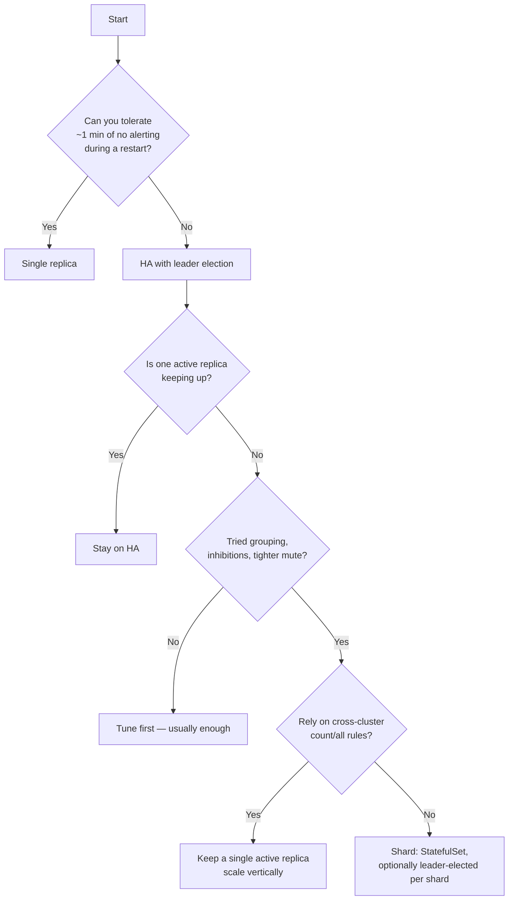

# Choose a deployment topology

Three supported shapes. Pick the smallest one that fits — each step up adds
real operational surface.

| Topology | Replicas | Buys you | Costs you |
| --- | --- | --- | --- |
| **Single** | 1 | Simplest possible | Alerting stops while the pod restarts |
| **HA** (recommended) | 2+ | Failover in ≤30s | A Lease, and persistence becomes mandatory |
| **Sharded** | N | Throughput | Stable per-replica identity; correlation rules under-count |

**Sharding is not an upgrade of HA — it is orthogonal.** HA gives failover;
sharding gives throughput. They compose, and a shard can itself be a
leader-elected pair.

## Single replica

```bash
helm upgrade --install alertkube ./helm \
  --set replicaCount=1 \
  --set persistence.enabled=true
```

Keep persistence on even here: it is what makes a restart cheap. Without it a
restart loses mute history (re-paging storm) and pending resolves (dangling
incidents).

Blind spot: nothing is evaluated between pod termination and the new pod's
cache sync — tens of seconds on a large cluster.

## HA with leader election

```bash
helm upgrade --install alertkube ./helm \
  --set replicaCount=2 \
  --set leaderElection.enabled=true \
  --set persistence.enabled=true
```

See [`examples/ha-leader-election.yaml`](https://github.com/aryasoni98/alertkube/blob/master/examples/ha-leader-election.yaml).

Active/passive: only the leader evaluates. Followers hold a synced informer
cache and are one Lease transition from leading. Worst-case leaderless window
is ~30s (the Lease duration).

!!! warning "Followers report Ready by design"
    A follower that reported NotReady would deadlock a `RollingUpdate` with
    `maxUnavailable: 0`. **A Ready pod showing zero active alerts is a
    follower, not a fault.** Do not "fix" it.

Persistence is effectively mandatory: the incoming leader restores mute history
and replays the outbox from it.

## Sharded

```bash
# One Deployment per shard, or a StatefulSet mapping the ordinal to the index.
--set env.ALERTKUBE_SHARD_TOTAL=3
--set env.ALERTKUBE_SHARD_INDEX=0    # unique and stable per replica
```

See [`examples/sharded.yaml`](https://github.com/aryasoni98/alertkube/blob/master/examples/sharded.yaml)
and [HA & sharding](ha-leader-election.md).

Every replica watches everything; each only *acts* on objects where
`fnv32a(kind/namespace/name) mod TOTAL == INDEX`.

**Each shard is fully independent** — its own Lease (`alertkube-shard-<i>`) and
its own state ConfigMap (`alertkube-state-<i>`). Both are required for
correctness, not tidiness:

- A shared Lease means exactly one shard leads and the rest watch nothing —
  while every pod reports Ready.
- A shared state object means each shard's save overwrites the others' mute
  history and outbox.

!!! important "Stable identity is required"
    A plain Deployment cannot give replicas stable ordinals. Use a StatefulSet
    (map the pod ordinal via the Downward API) or N separate Deployments. Two
    replicas sharing an index both own the same objects and will double-page.

Before choosing this, exhaust the cheaper options: tighten `muteSeconds`,
enable `grouping`, add inhibitions. 8,000 simultaneously active alerts is
usually a signal problem, not a capacity problem.

### What sharding does not give you

- **Less memory.** Informer caches scale with total object count, not shard
  count. Budget the full object set on every replica.
- **Correct cross-shard correlation.** A `count`/`all` rule sees only its own
  shard's stream and under-counts. Keep those on a single active replica.
- **Instant rebalancing.** Rebalancing is a rollout of `ALERTKUBE_SHARD_TOTAL`.

## Decision guide



## See also

- [HA & sharding](ha-leader-election.md) — Lease/state scoping, rebalancing
- [Operations guide](https://github.com/aryasoni98/alertkube/blob/master/docs/OPERATIONS.md) — SLOs, capacity, runbooks
- [Tune mute and grouping](tune-mute-and-grouping.md) — do this before sharding
