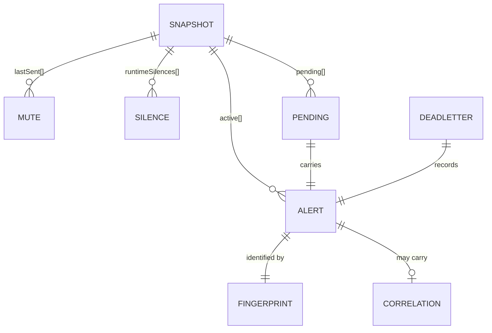
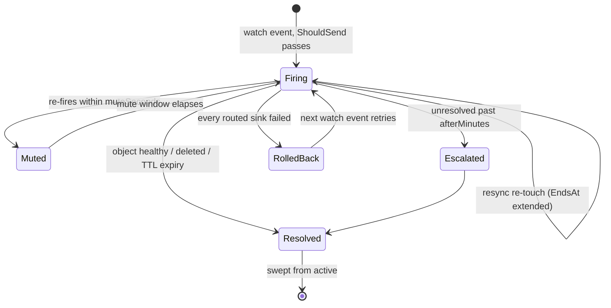

# Data model

The core types and how they relate. Everything hangs off the fingerprint.



## Alert

The unit of everything. Produced by watchers, cloud sources, the receiver, and
the rule engine; consumed by the store, router, grouper, and sinks.

| Field | Purpose |
| --- | --- |
| `Kind` | Resource kind (`Pod`, `Node`, `EKSCluster`, …). Part of identity |
| `Namespace` | K8s namespace, **or** the cloud scope (region / subscription / `project/location`) |
| `Name` | Object or cloud-resource id |
| `Reason` | Why it fired (`CrashLoopBackOff`, `OOMKilled`). Part of identity |
| `Severity` | `critical` / `warning` / `info` |
| `Fingerprint` | `sha256(kind\|namespace\|name\|reason)` — see below |
| `Summary` | Human-readable one-liner |
| `Labels` | Routing/matching inputs (`node`, `provider`, `region`, …) |
| `Details` | Enrichment (events, logs, describe). Empty values dropped |
| `Cluster` | Cluster label from config |
| `StartsAt` / `EndsAt` | Fire time; `EndsAt` is the resolve TTL deadline |
| `Resolved` | This is a resolve, not a firing |
| `Event` | Fire-once: dispatched immediately, never tracked or resolved |
| `Correlation` | Optional blast-radius annotation |

## Fingerprint

```
sha256(kind | namespace | name | reason)
```

The spine of the system. It is the dedupe key, the mute key, the resolve
target, and — since delivery became fingerprint-affine — the dispatch worker
assignment key.

Note what it **includes**: `reason`. Two problems on one pod are two
fingerprints and page independently. And what it **excludes**: severity,
labels, timestamps. A pod that escalates from warning to critical for the same
reason keeps one identity, so it does not double-page.

Shard ownership deliberately uses `kind/namespace/name` — *not* the
fingerprint — so every reason on one object, and its delete-resolve, are owned
by the same replica.

## Snapshot

What persistence writes: gzipped JSON in a ConfigMap.

| Field | Contents |
| --- | --- |
| `Active` | Currently firing alerts, keyed by fingerprint |
| `LastSent` | Fingerprint → last send time; the mute window |
| `RuntimeSilences` | Silences created via the API (not config or CRD) |
| `Pending` | The delivery outbox |
| `SavedAt` | Snapshot time, logged on restore |

Losing `LastSent` causes a re-paging storm on restart. Losing `Pending` dangles
stateful incidents. That is why sharded replicas must not share one object.

## PendingDelivery

One outbox record: an accepted-but-unacknowledged delivery.

| Field | Purpose |
| --- | --- |
| `ID` | Monotonic id; the ack key |
| `Alert` | Details-stripped clone, so the persisted record stays small |
| `Route` | Sink names this was routed to |

Added on enqueue, removed when the delivery reaches a terminal outcome
(delivered, rolled back, or dead-lettered). Replayed on startup — gated on
shard ownership, since a rebalance moves objects.

## Silence

Same shape from three sources, all matched identically by the router:

| Source | Lifetime | Persisted |
| --- | --- | --- |
| Config file | Until config changes (rollout) | n/a |
| Silence CRD (`alertkube.io/v1alpha1`) | Until deleted | etcd (the CRD's own) |
| Runtime API | Until `Until` elapses | State ConfigMap |

Fields: `Matchers` (label → value), `Until` (RFC3339), `Comment`, `CreatedBy`,
`ID`. A silence suppresses matching alerts entirely — no delivery, no state
change.

## Inhibition

Suppresses a *dependent* alert while a *cause* alert is firing. Config-only.

Fields: `Source` (matcher), `Target` (matcher), `Equal` (labels that must match
between them), `Duration`.

`Equal` is what scopes it correctly: without `equal: [node]`, a single NotReady
node would suppress pod alerts cluster-wide.

## Correlation

Optional annotation describing an alert's blast radius. Produced by the
correlation engine (`internal/topology`, in progress) and attached to active
alerts without bumping the store generation — it is derived, so it is not worth
a persistence write.

## DeadLetterEntry

A permanently abandoned delivery, held in a bounded ring and served by
`GET /api/v1/deadletter`. Two causes: a resolve that exhausted its retries (an
incident may dangle) or a fire-once alert that failed with no retry path.
Counted on `alertkube_dead_letter_total` — alert on it.

## Lifecycle


